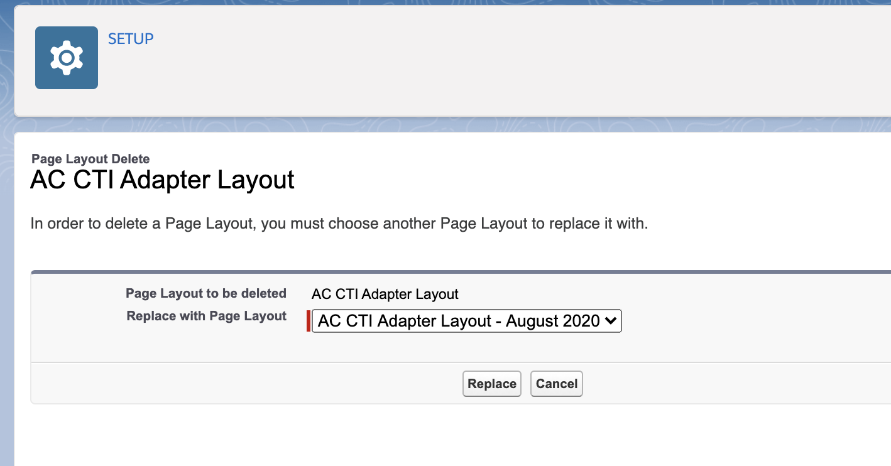
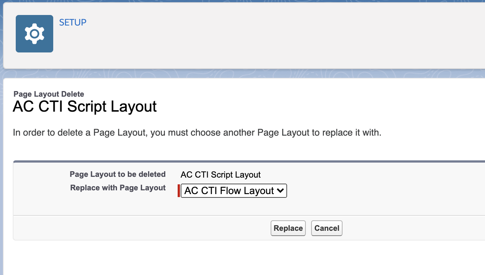

<h1 class="toc">Upgrading from an Earlier Version</h1>

If you are upgrading from an earlier major version of the CTI Adapter (v4.x or earlier), there are a
few additional things you need to do.

1.  Go to the **Setup** section and search for **Object Manager**.

2.  In Object Manager section, search for "AC CTI"

3.  Open up **AC CTI Adapter**

4.  On the left sidebar, click on **Page Layouts**

5.  Click on **Page Layout Assignment**

6.  On the next page, click on **Edit Assignments**

7.  Click on the grey bar at the top of the table to select all rows.

8.  Open the **Page Layout to Use** dropdown and select **AC CTI Adapter
    Layout -- August 2020**.

9.  Click **Save** and go back to **Page Layouts**.

10. Click on the dropdown next to the item labelled **AC CTI Adapter
    Layout** and click **Delete**.

11. Confirm **Yes** in the next dialogue where you will be asked "Are
    you sure?"

12. If you see a screen titled **Deletion Problems**, find and click
    **Delete**.

13. You will be asked which layout you want to replace it with. Select
    **AC CTI Adapter Layout -- August 2020** and click **Replace.**

Now we are going to do the same thing for **AC CTI Script Layout**.

1.  Open up **AC CTI Script Layout**

2.  On the left sidebar, click on **Page Layouts**

3.  Click on **Page Layout Assignment**

4.  On the next page, click on **Edit Assignments**

5.  Click on the grey bar at the top of the table to select all rows.

6.  Open the **Page Layout to Use** dropdown and select **AC CTI Flow
    Layout**.

7.  Click **Save** and go back to **Page Layouts**.

8.  Click on the dropdown next to the item labelled **AC CTI Script
    Layout** and click **Delete**.

9.  Confirm **Yes** in the next dialogue where you will be asked "Are
    you sure?"

10. If you see a screen titled **Deletion Problems**, find and click
    **Delete**.

11. You will be asked which layout you want to replace it with. Select
    **AC CTI Flow Layout** and click **Replace.**

12. Go to your **CTI Adapter**.

13. Click on any of the CTI Flows and scroll down to the section labeled
    **CTI Flow**. You should see something like this:

14. Click **Download** and save your script before clicking
    **Continue**.

15. Use the CTI Block primitives in the editor to re-create your script
    as a CTI Flow.

16. Refer to the Sample Flows in the Appendix of this manual.
