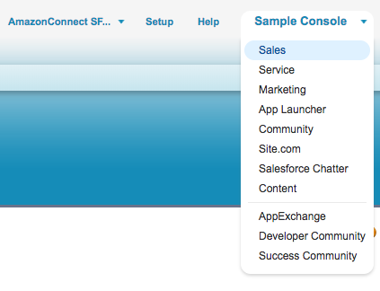
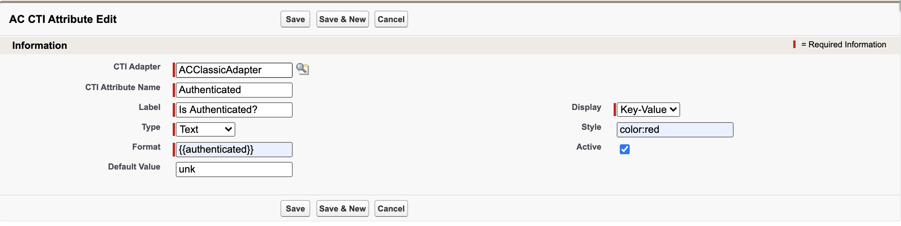

<h1 class="toc">Contact Attributes Display</h1>

Amazon Connect allows for user defined Contact Attributes to be attached
to a phone call within Contact Flows. This can be used to track caller
inputs, IVR selections, outcomes of an interaction with Amazon Lex, or
data lookup from backend systems through Lambda. Some of those values
can be useful to be displayed to the agent to speed up data input or
skip processes such as authenticating the customer.

Amazon Connect allows data classifications for contact\'s attributes.
The classification engines scans configured metadata and identifies text
and links attributes to display in Attributes and Links sections
respectively.

To configure a contact attribute for display within embedded CCP:

In the top navigation bar, select the "+" icon.

Select "AC CTI Adapters"

Create a new adapter. Fill in the CTI Adapter Name, and Amazon Connect
Instance Alias. For the Call Center Definition Name, type in
ACConsoleAdapter. Select Save.

1.  Log in to your Salesforce Org.

2.  From the top right corner, select the **Sales** application.

3. Select **AC CTI Adapters** and select your adapter

4.  Scroll down to the attributes section and select **New AC CTI
    Attribute**

5.  Provide a **CTI Attribute Name**, for example: authenticated

6.  Provide the **Label** name, for example:

7.  Select the **Display** option, in this case: Key-Value

8.  Select Text as the **Type**

9.  For **Style**, enter the following: *color: red*

10. In the **Format** field, enter *{{phone_number}}* to reference the
    incoming contact attribute

11. Set **Default Value** to *unk*

12. Choose **Save**

13. Open the Amazon Connect Contact Flow Designer and drop *Set \> Set
    Contact Attributes* block to your Contact Flow. Set the attribute
    based on your business logic. For example:

14. Place and inbound call and ask to speak with an agent. Accept the
    incoming call and check if Contact Attribute is displayed in the
    embedded CCP.

There are additional features that can be used to further customize CTI
attributes.

1.   In the Sales application, navigate to your CTI Adapter your CTI Adapter

2.  Scroll down to the Features section. Select **New AC Feature**.

3.  Set the AC Feature Name to **FEATURE_CTI_ATTRIBUTES**

4.  Fill the value text box to contain the following settings:

    a.  **ShowAttributesIfEmpty** (Boolean, default true): show
        attributes text box when contact has no attributes

    b. **ShowAllAttributes** (Boolean, default false): show all attributes, including attributes with no value

5.  Select **Save**