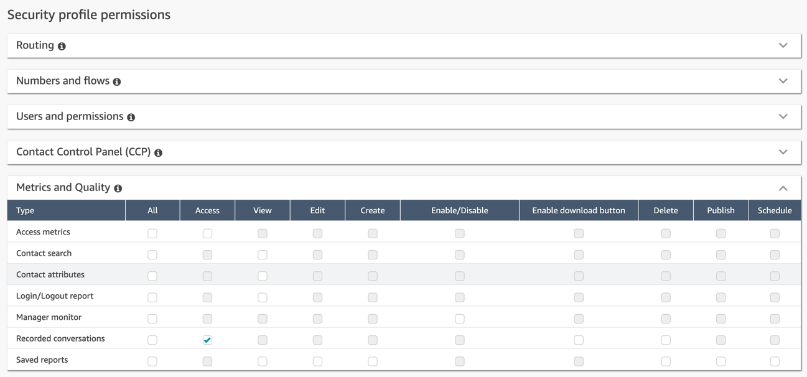
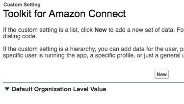
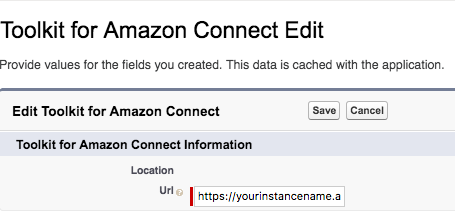
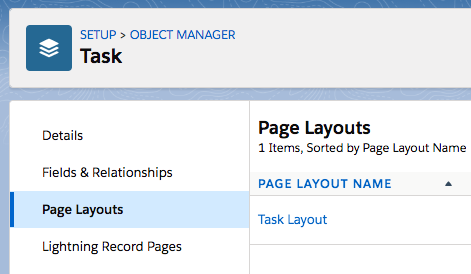

<h1 class="toc">Call Recording Link for Task</h1>

The Adapter comes with a Visualforce component that provides users with
the ability to download a call recording created within Amazon Connect
from a Salesforce page.

The security profile assigned to Amazon Connect agents using the Call
Recording Link for Task functionality must have "Access" enabled under
"Metrics and Quality \> Recorded conversations".

To configure Call Recording links:

1.  Log in to your Salesforce Org

2.  Navigate to **Setup** then in type *Custom Settings* in Quick Find

3.  Click on the "Manage" link next to the "Toolkit for Amazon Connect" custom setting

4.  Next, click on the "New" button on the top of the page, which will create the Default Organization values.

5.  On the following page, provide the URL to your Amazon Connect instance without path information. The value of the URL field would be in the form of: https://your-instance-alias.awsapps.com

The Adapter creates a Task in Salesforce for every phone interaction
received by an agent. This Task will always be linked to the phone
call via the Amazon Connect Contact ID. If Amazon Connect is
configured to record the phone calls, the recording can be made
available on the Task details page.

The Visualforce Page for the call recording is already added to this
Layout. The recommended height is 70px.

To edit the sample Task Page Layout, please follow the steps:

1.  Log in to your Salesforce Org

2.  Navigate to **Setup** then in type *Object Manager* in Quick Find

3.  Click on the "Task" object

4.  Click on the "Page Layouts"

5.  Click on the "*Task Layout*" and the layout designer will open

6.  Drag the "ACSFCCP_CallRecording" item to the desired are of the layout to have that information appear on the agent's screen. The following screenshot shows how the Call Details section could appear when placing the "ACSFCCP_CallRecording" item on the required Task layout.

7.  To have access to the recording, the user must have an active session with Amazon Connect. This can be achieved by either logging in to the CCP softphone, or by logging in to Amazon Connect outside of Salesforce. After the session is established, a page refresh should make the player appear.
