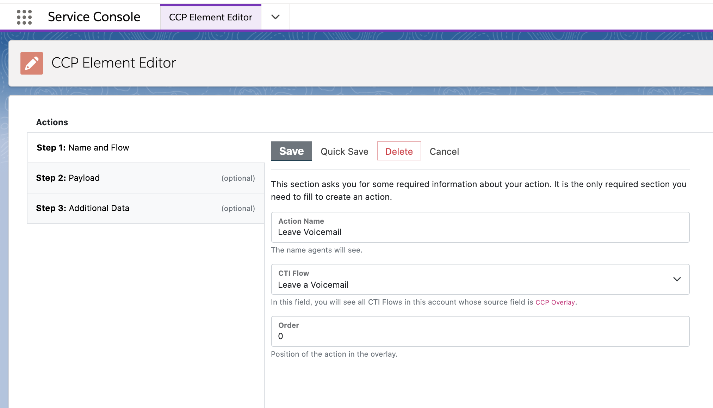
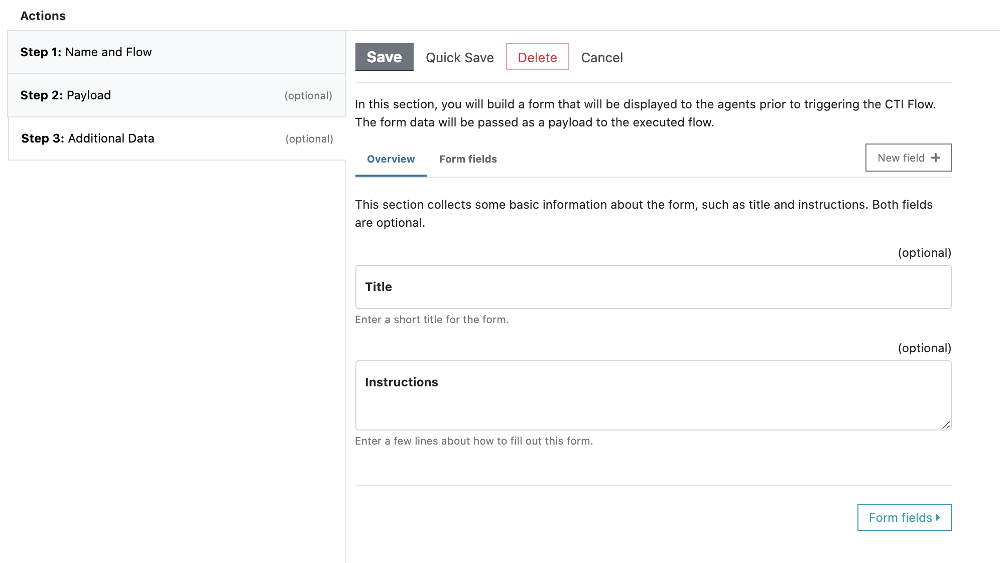
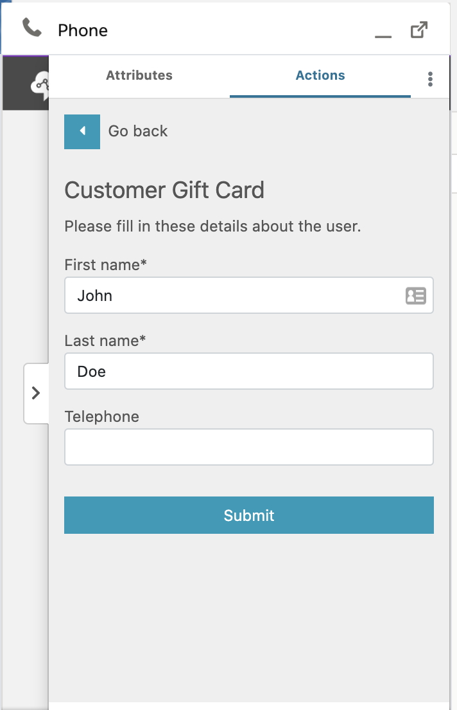

<h2 class="toc">CTI Actions</h2>

CTI Actions allow your agents to trigger CTI Flows with the push of a button. You can configure a CTI Action the CCP Element Editor page.

Make sure that you have created a CTI Flow and it uses the source "CTI Action." Only these CTI Flows will be displayed in the dropdown field.

You can optionally specify a payload to pass to the CTI Flow. This payload can be used in your CTI Flow. Another option is to allow your agents to enter additional data about the customer or the nature of the call. The CCP Element Editor gives you the ability to add form fields into your form as well.

### CCP Overlay

The Actions panel in the CCP Overlay drawer displays the CTI Actions, where your agents can have easy access to them as they are talking to customers.

If an action requires additional input by the agent, its name will be followed by an arrow and when the agent clicks on this item, it will open a form you have configured.

If not, it will be shown with an "Execute" button next to its name.

### Receiving Data from CTI Flows

Just as your agents can send data to the CTI Flow, they can receive data as well. When a CTI Flow sends some information to the CCP overlay, it will be displayed in the Data panel.

This is what your block will look like in your CTI Flow.

### Upgrading from an earlier version

If you are upgrading from an earlier version of CTI Adapter, there are a few additional things you need to do.

1. Go to Setup
2. In "Quick Find," search for "Picklist Value Sets" and click on the result.
3. Select "AC_CtiScriptSource" on "Picklist Value Sets" page.
4. Scroll down to "Values" section
5. Click "New" to add a new value.
6. In the textarea, enter "ctiAction" and save
7. Scroll down to the new field you added, "ctiAction," and click "Edit."
8. Update the label to "CTI Action" and save.
