<h1 id="invoking-the-amazon-connect-salesforce-lambda-in-a-contact-flow"> Invoking the Amazon Connect Salesforce Lambda in a Contact Flow </h1>

The Amazon Connect Contact Flow defines the routing behaviour within
Amazon Connect, allowing contact center administrators to customize call
flow behaviour such as playing prompts, invoking Lambda functions for
data lookup, and sending the call to different queues based on various
conditions. As a result, Contact Flows are expected to be highly
customized for each organization. While the Adapter package does not
provide any Contact Flows, there are some best practices that are worth
highlighting when utilizing the Adapter.

The key element that enables Contact Flow integration is the AWS Lambda
function. A Lambda function is a serverless piece of code that is
invoked by the Contact Flow. Typically, Lambda functions are used to
update or retrieve information from databases or APIs, as well as
integrating with other systems. Lambda function can return any data
processed to the Contact Flow where it can be used for decision making.

Since Salesforce is highly customizable, the same Salesforce object in a
different environment may have different fields associated with it. As a
result, we can expect objects to have different requirements for how
they are retrieved, updated and created. The CTI Adapter was built to be
able to query Salesforce objects regardless of how they have been
customized. The user of the Adapter must therefore ensure they are
passing the appropriate parameters to the Lambda functions provided as
part of the Adapter.

The Lambda function supports different operations, based on the
mandatory input parameter "sf_operation".

Salesforce Lookup
-----------------

This operation is invoked by setting "sf_operation" to "lookup". In this
case, the Lambda function queries Salesforce for objects based on the
parameters passed to it.

-   "**sf_object**" parameter contains Salesforce Object, like Case, Contact etc.

-   "**sf_fields**" parameter contains a set of fields to be returned in a result. For example, if we are querying Case, we might specify "Id, IsClosed, Subject", or if we are querying Contact, we might specify "Id, Name, Email"

-   Specify a conditional parameter, for example "CaseNumber" or "homephone". Multiple values may be sent and they will be applied with "AND" operator.

In the Amazon Connect Contact Flow Designer, add *Integrate \> Invoke
AWS Lambda function* block. Set 'sfInvokeAPI' Lambda ARN and make sure
you have granted Amazon Connect to invoke the Lambda Function.

Example for phone number lookup:


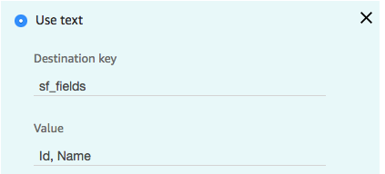


A result example:

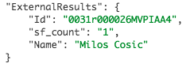

Example for Case lookup:


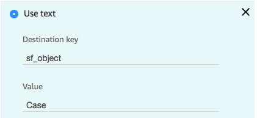


A result example:

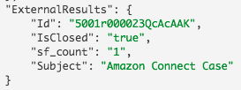

Salesforce Create
-----------------

This operation is invoked by setting "sf_operation" to "create". In this
case, the Lambda function creates a Salesforce object based on the
parameters passed to it.

-   "**sf_object**" parameter contains Salesforce to be created, like Case.

-   Specify additional parameters for the Salesforce object to be created. Please be sure to include all parameters required to create the Salesforce object.

In the Amazon Connect Contact Flow Designer, add *Integrate \> Invoke
AWS Lambda function* block. Set 'sfInvokeAPI' Lambda ARN and make sure
you have granted Amazon Connect to invoke the Lambda Function.

An example for Case creation:


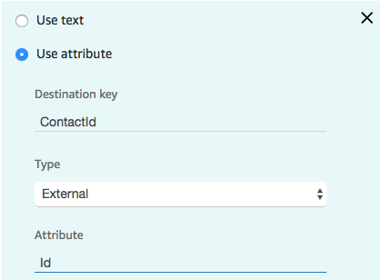

Contact Id is usually received as a result of a previous phone lookup,
but it can be also stored as an Attribute (i.e. sf_contact_id)


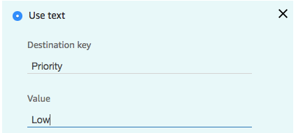

A result example (providing the newly created Case Id):

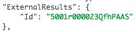

Salesforce Update
-----------------

This operation is invoked by setting "sf_operation" to "update". In this
case, the Lambda function updates a Salesforce object based on the
parameters passed to it.

-   "**sf_object**" parameter contains Salesforce to be updated, like Case.

-   Specify additional parameters for the Salesforce object to be created. Parameters must include \`sf_object\` and \`sf_id\`.

In the Amazon Connect Contact Flow Designer, add *Integrate \> Invoke
AWS Lambda function* block. Set 'sfInvokeAPI' Lambda ARN and make sure
you have granted Amazon Connect to invoke the Lambda Function.

An example for Case update:

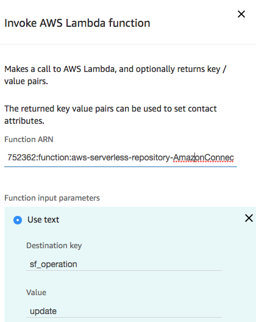

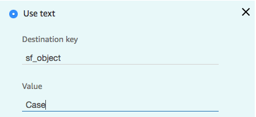


Case Id is usually received as a result of a previous case lookup, but
it can be also stored as an Attribute (i.e. sf_case_id)


A result example (HTTP Status Code):


204 is "No Content" success code

Salesforce Phone Lookup
-----------------------

This operation is invoked by setting "sf_operation" to "phoneLookup". In
this case, the Lambda function queries Salesforce for Contacts based on
the parameter passed to it.

It uses the Salesforce Object Search Language (SOLS) to construct
text-based search queries against the search index, which gives
significant performance improvement when searching phone number fields.

-   "**sf_phone**" parameter contains the phone number to search.

-   "**sf_fields**" parameter contains a set of fields to be returned in a result. As it searches for Contacts, we might specify "Id, Name, Email"

In the Amazon Connect Contact Flow Designer, add *Integrate \> Invoke
AWS Lambda function* block. Set 'sfInvokeAPI' Lambda ARN and make sure
you have granted Amazon Connect to invoke the Lambda Function.

Example for phone number lookup:


A result example:


Salesforce query
----------------

This operation is invoked by setting "sf_operation" to "query". In this
case, the Lambda function uses Salesforce Object Query Language (SOQL)
to conduct a query against the Salesforce instance.

-   "**query**" parameter contains the query.

Any additional parameters will replace text values in the original query
so that queries can be dynamic based on values stored within the contact
flow. For example, the parameter set:

-   query: "select {{field}} from {{object}}"

-   field: "Id"

-   object: "Task"

Will result in the query: "select Id from Task".


In the contact flow example below, we look for a customer by phone number.


(full text of the value is "select Id from Contact where Phone LIKE \'%{{number}}%\'")

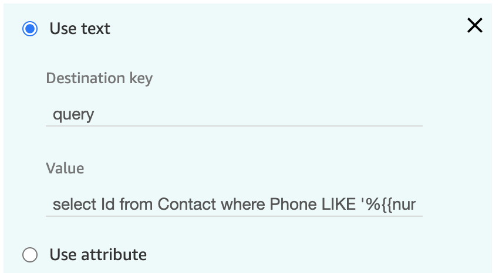

This operation returns a response of:

```json
{
    "sf_records": [
        {
            "Id": "00303000001RZfIAAW"
        }
    ],
    "sf_count": "1"
}
```

Salesforce queryOne
-------------------

This operation is invoked by setting "sf_operation" to "queryOne" (case
sensitive). In this case, the Lambda function uses Salesforce Object
Query Language (SOQL) to conduct a query against the Salesforce
instance, returning a result only when one record is returned from the
query. For query, the following parameter is required:

-   "**query**" parameter contains the query.

Any additional parameters will replace text values in the original query
so that queries can be dynamic based on values stored within the contact
flow. For example, the parameter set:

-   query: "select {{field}} from {{object}}"

-   field: "Id"

-   object: "Task"

Will result in the query: "select Id from Task".

In the contact flow example below, we look for a customer by phone number.


(full text of the value is "select Id from Contact where Phone LIKE
\'%{{number}}%\'")


This operation returns a response of:

```json
{
    "sf_records": [
        {
            "Id": "00303000001RZfIAAW"
        }
    ],
    "sf_count": "1"
}
```

Salesforce createChatterPost
----------------------------

This operation is invoked by setting "sf_operation" to
"createChatterPost" (case sensitive). In this case, the Lambda function
uses the Salesforce Connect REST API to create a chatter post (see
[here](https://developer.salesforce.com/docs/atlas.en-us.chatterapi.meta/chatterapi/quickreference_post_feed_item.htm)).
For createChatterPost, the following parameters are required:

-   sf_feedElementType

-   sf_subjectId

-   sf_messageType

-   sf_message

The following parameter is optional:

-   sf_mention

(refer to the api reference for value types)

Any additional parameters will replace text values in the sf_message so
that messages can be dynamic based on values stored within the contact
flow. For example, the parameter set:

-   sf_message: "Please help me with case {{caseId}}"

-   caseId: 1234

Will result in the message: "Please help me with case 1234".

In the contact flow example below, we leave a chatter post on a contact.

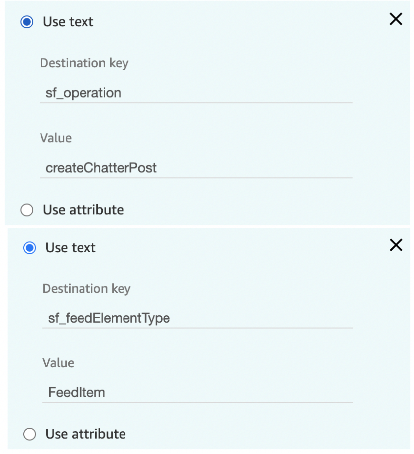

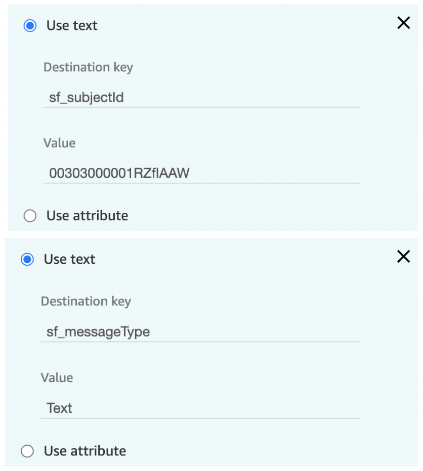


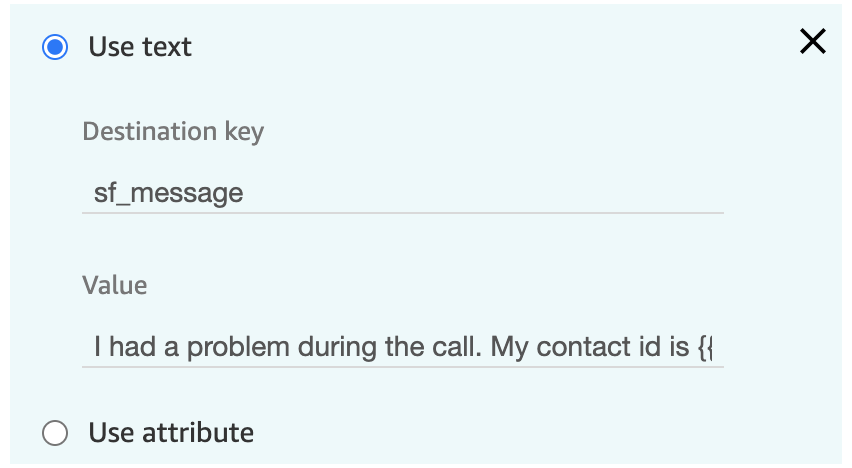

(full text of the value is "I had a problem during the call. My contact id is {{contactId}}.")

The operation returns a response of:

```json
{
    "Id": "0D503000000ILY5CAO"
}
```


the Subject:

Salesforce createChatterComment
-------------------------------

This operation is invoked by setting "sf_operation" to
"createChatterComment" (case sensitive). In this case, the Lambda
function uses the Salesforce Connect REST to create a chatter comment
(see [here](https://developer.salesforce.com/docs/atlas.en-us.chatterapi.meta/chatterapi/connect_resources_feed_element_capability_comments_items.htm)).
For createChatterComment, the following parameters are required:

-   sf_feedElementId

-   sf_commentType

-   sf_commentMessage

(refer to the api reference for value types)

Any additional parameters will replace text values in the
sf_commentMessage so that messages can be dynamic based on values stored
within the contact flow. For example, the parameter set:

-   sf_commentMessage: "Please help me with case {{ caseId }}"

-   caseId: 1234

In the contact flow example below, we leave a comment on a chatter post.

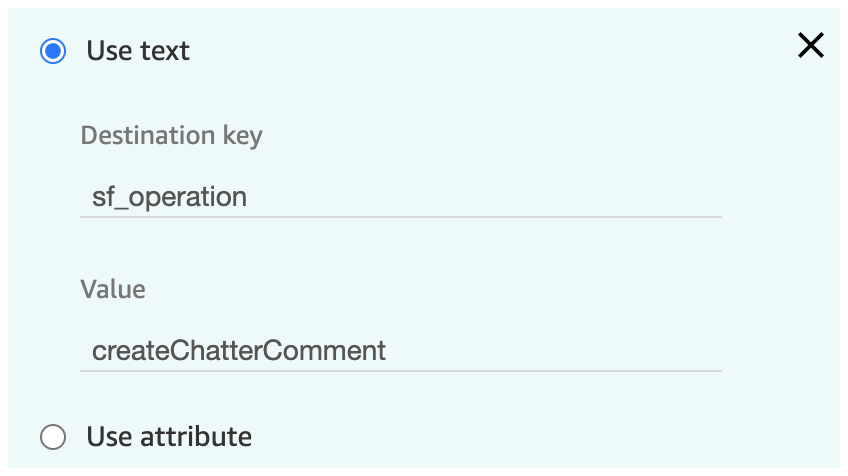

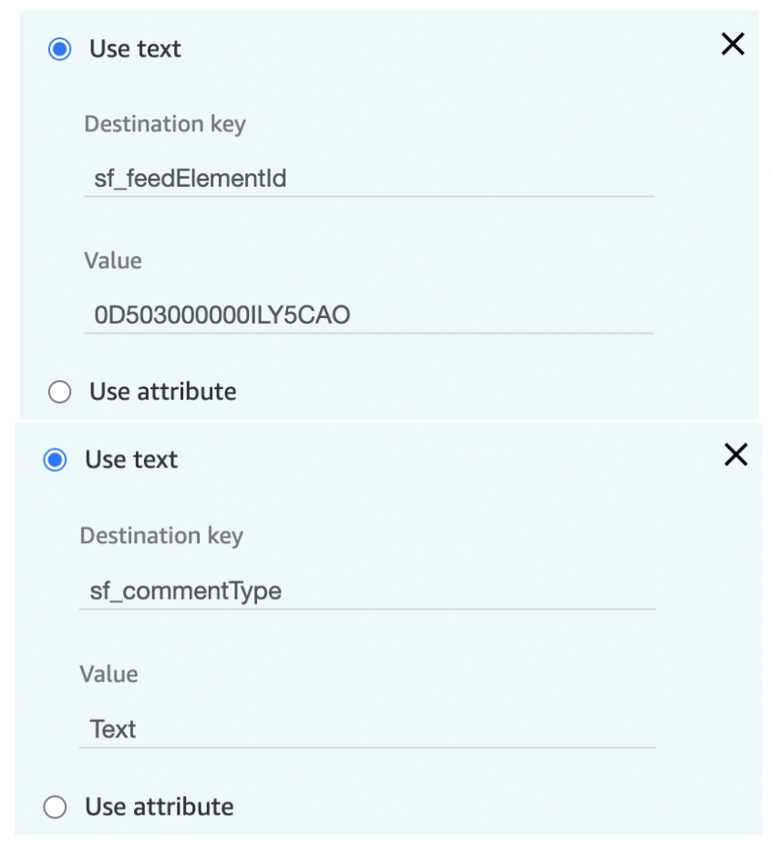

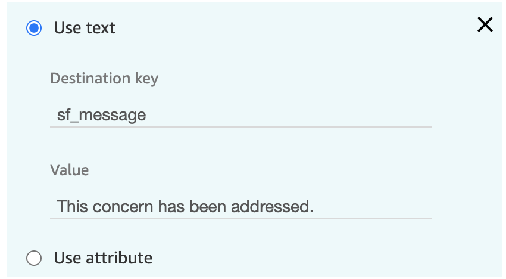

The operation returns a response of:

```json
{
    "Id": "0D703000000ChhNCAS"
}
```


See the chatter post appear attached to the Subject: