<h2 class="toc">Installing CTI Adapter Managed Package from AppExchange</h2>

The Amazon Connect CTI Adapter for Salesforce provides the core
integration between the two platforms. It embeds the Amazon Connect
Contact Control Panel into Salesforce which provides telephony control
as well as access to event data coming from Amazon Connect. Using this
adapter, you can configure screen pops based on customer data, automate
contact center telephony functions like click-to-dial, and establish
presence syncing rules for integration with Salesforce Omni-Channel.
This is the base of the integration.

<h3 class="toc">Installing the Package</h3>

The first step in the deployment of the integration is to install the
Amazon Connect CTI Adapter managed package from the AppExchange
Marketplace.

1.  Log in into your Salesforce org and go to **Setup**

2.  In the **Quick Find**, type **AppExchange** (the results will
    populate without hitting enter)

3.  Select **AppExchange Marketplace** from the links provided

4.  In the AppExchange window, enter **Amazon Connect** into the
    **Search AppExchange** field and press enter

5.  In the **Search Results**, select **Amazon Connect CTI Adapter**

6.  On the **Amazon Connect CTI Adapter** detail page, select **Get It
    Now**

7.  If you are presented with the Log In to AppExchange screen, select
    **Open Login Screen**. You should then be presented with an Allow
    Access Screen. Choose **Allow**

8.  On the **Where do you want to install Amazon Connect CTI Adapter**
    page, choose the **Install Here** button in the Install in This Org
    section

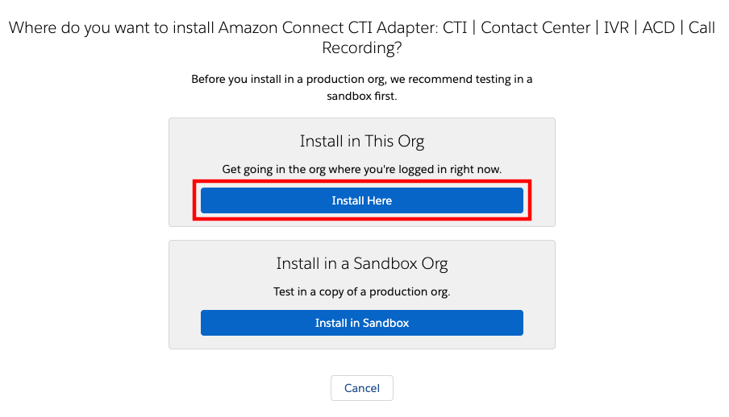

9.  On the **Confirm installation details** screen, fill out the **Tell
    us about yourself** form, check the box to **agree with the terms
    and conditions**, and optionally select the box to **allow the
    provider to contact you**. Then select **Confirm and Install**

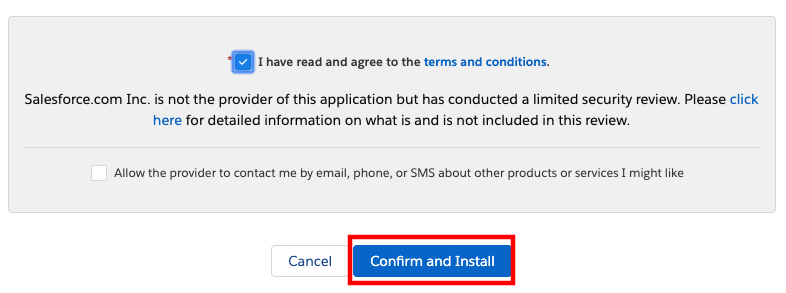

10. Select **Install for All Users**, then choose **Install**

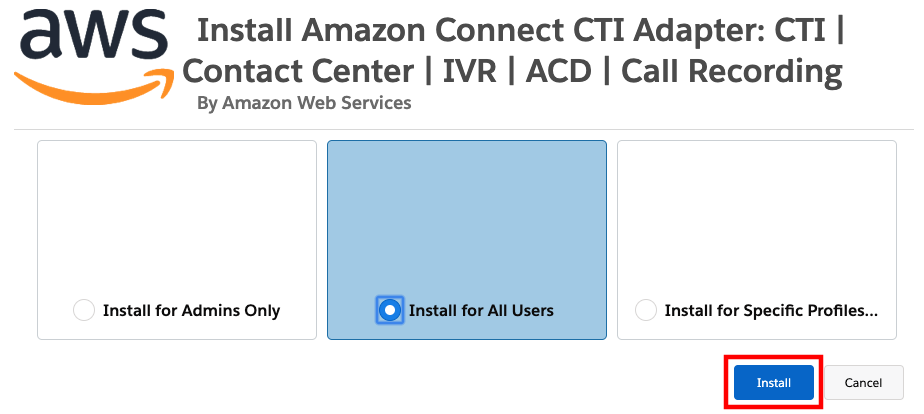

11. The CTI Adapter will take some time to install. While it installs,
    you will be presented with the **This app is taking a long time to
    install screen.**

12. Choose **Done**.

13. Once you receive confirmation that the **installation has
    completed** via email, return to the browser

14. Close the **Amazon Connect CTI Adapter** detail page (if still open)

15. In Quick Find, enter **Installed**, then select Installed Packages
    from the result

16. Once the **Installed Packages** page opens, validate that the
    **Amazon Connect -- Universal Package** is installed

<h3 class="toc">Set Access Permissions</h3>

All users must be assigned the required permission set to access
Salesforce metadata. The Amazon Connect CTI Adapter includes two
Permission Sets, one for agents and one for managers, that grant users
the appropriate access for their role. More information on assigning
user permissions can be found in the [Salesforce help
documentation](https://help.salesforce.com/articleView?id=perm_sets_mass_assign.htm&type=5).

1.  Log in into your Salesforce org and go to **Setup**

2.  In **Quick Find**, enter **Permission** and select **Permission
    Sets** from the results

3.  Choose **AC_Administrator**, **AC_Agent** or **AC_Manager** as
    appropriate for the user(s)

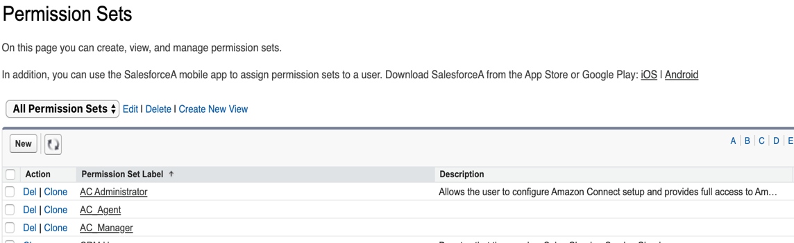

4.  Choose **Manage Assignments**.

5.  Choose **Add Assignments**.

6.  Select the users to assign the permissions, then choose **Assign**.

7.  Repeat these steps as needed for all users

#### AC_Administrator

#### AC_Manager

#### AC_Agent

<h3 class="toc">Configure the Lightning Experience</h3>

In this guide, we will configure the CTI Adapter for Service Console
(Lightning Experience). You may use the same procedure described in this
section for other applications.

<h4 class="toc">Configure Service Console</h4>

First, you need to add the CTI softphone to your Service Console.

1.  Log in into your Salesforce org and go to **Setup**

2.  In the **Quick Find** box, type **App Manager**, then choose **App
    Manager** from the result list.

3.  Expand the drop-down menu associated to Service Console and select
    **Edit**.

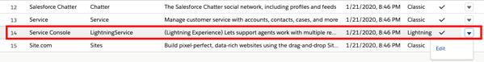

4.  Once the **Lightning App Builder** opens, select **Utility Items**
    from the left Navigation

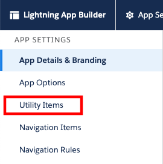

5.  Choose **Add Utility Item**, then select **Open CTI Softphone**.

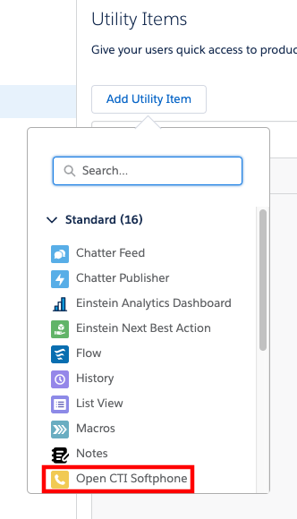

6.  Change the Label, if desired, then choose **Save**.

<h4 class="toc">Whitelist Your Salesforce Org with Amazon Connect</h4>

In order to embed the Amazon Connect Contact Control Panel (CCP) into
your Service Console, you need to whitelist two (2) domains for your org
with Amazon Connect. This allows for cross domain access to the
underlying resources required for the CCP to function.

1.  Log in into your Salesforce org and go to **Setup**

2.  Copy the entire URL of this page and past it to a text document.

3.  In the **Quick Find** field, type **visual**, then select **Visual
    Force Pages** from the results

4.  Choose the **AC_LightningAdapter** Visualforce page

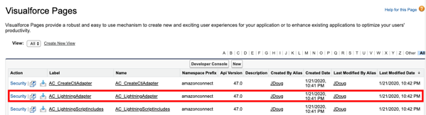

5.  On the Visualforce detail page, select the **Preview** button. This
    will open a new browser tab showing the page content, which should
    only be a button labelled Sign in to CCP. Copy the entire URL of
    this page and past it to a text document.

6.  In a new browser tab, login to the [**AWS
    console**](https://console.aws.amazon.com/)

7.  Navigate to the [Amazon Connect
    Console](https://console.aws.amazon.com/connect/home)

8.  Validate that you are in the correct **AWS region** for your
    instance, then select your instance alias from the list of
    instances

9.  Choose **Application Integration** from the left navigation

10. Select + Add origin

11. In the Enter origin URL field, enter the URL of the page that you
    copied in step 2. Only enter the url through the .com, for example:
    <pre>https://XXXXXXXX-dev-ed-.lightning.force.com</pre>

12. Select Add. You should see your org domain listed in the Approved
    origins section.

13. Select + Add origin

14. In the Enter origin URL field, enter the URL of the visualforce page
    that you copied in step 5. Only enter the url through the .com, for
    example:
    <pre>https://XXXXXXXX-dev-ed\--amazonconnect.visualforce.com</pre>

15. Select Add. You should see your org domain listed in the Approved
    origins section

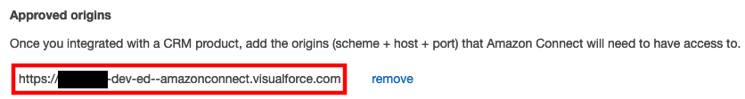

<h4 class="toc">Modify the Call Center</h4>

Now that you have whitelisted the org in the Amazon Connect Console, you
will need to modify the Call Center that was configured in Salesforce
when the AppExchange package was installed. Once you complete the
configuration, you add users to the Call Center to provide access to it.

1.  Log in into your Salesforce org and go to **Setup**

2.  In the **Quick Find** field, enter **Call Center**, then select
    **Call Centers** from the result list

3.  If you see the **Say Hello to Salesforce Call Center** page, select
    **Continue**

4.  Select **AC Lightning Adapter**

5.  On the **AC Lightning Adapter** detail page, select **Edit**

6.  Next, change the values for **Softphone Height** **to 570** and the
    **Softphone Width to 330**, and choose **Save.**

7.  Once you return to the AC Lightning Adapter detail page, choose
    **Manage Call Center Users** in the Call Center Users section

8.  On the **AC Lightning Adapter: Manage Users** page, select **Add
    More Users**.

9.  Set filters (if desired) and then choose **Find**.

10. Select the checkbox next to the user to add, then choose **Add to
    Call Center**.

11. Repeat the steps to add more users.

<h4 class="toc">Configure the Toolkit settings</h4>

1.  Navigate to **Setup** then in type **Custom Settings** in Quick
    Find

2.  Next to the Toolkit for Amazon Connect custom setting, choose
    **Manage**

3.  Select **New**

4.  On the following page, provide the URL to your Amazon Connect
    instance. The value of the URL field would be in the form of:
    <pre>https://your-instance-alias.awsapps.com</pre>

5.  Select **Save**

<h4 class="toc">Create the Softphone Layout</h4>

Next, we need to create a softphone layout for the solution. The
softphone layout settings will tell the console what resources are
available for screenpop by default and what to do under different match
conditions.

1.  Log in into your Salesforce org and go to **Setup**

2.  In the **Quick Find** box, type **Softphone**, then choose
    **Softphone Layouts** from the results

3.  If you are presented with the Get Started message, choose
    **Continue**

4.  On the Softphone Layouts page, choose **New**

5.  Enter a name for the layout, such as **AmazonConnectDefault**, then
    select the **Is Default Layout** checkbox.

6.  Expand **Display these salesforce.com objects** and select objects
    that CTI Connector should be able to search, for a screen-pop query.
    In this example, Case has been added to the default selection,
    allowing search and screen-pop by CaseID.
    

7.  If desired, configure the search behavior to your requirements

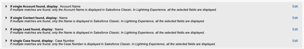

8.  Additionally, validate the Screen Pop settings. Please note that the
    default behavior is to not pop a screen if there is more than one
    result

9.  Once you have configured the search behavior, choose **Save**

<h3 class="toc">Initial CTI Adapter Configuration</h3>

Once we have setup the Call Center, we need to do a final configuration
of the CTI Adapter before we can test the basic configuration. This will
tie the Lightning CTI adapter settings to the Call Center.

<h4 class="toc">Add the CTI Adapter Console App</h4>

1.  Log in into your Salesforce org and go to the **Service Console**

2.  Expand the **navigation menu** by selecting the down arrow and
    choose **Edit**.

3.  On the Edit Service Console App Navigation Items page, select **Add
    More Items**

4.  Select the **+** next to **AC CTI Adapters** and select the **Add 1
    Nav Item** button

5.  If desired, move the **AC CTI Adapters** button up in the navigation
    Items menu by dragging it up or down the list, then choose **Save**
    to save changes

6.  Select **AC CTI Adapters** from navigation menu

7.  If Recently Viewed is selected, select the drop-down and select
    **All** from the List Views menu.

8.  If no ACLightningAdapter entry exists, then select the new button to
    configure your AC CTI adapters, otherwise select the
    **ACLightningAdapter**

9.  Fill out or confirm the Details as follows:

10. CTI Adapter Name: **ACLightningAdapter**

11. Amazon Connect Instance Alias: The alias of your Amazon Connect
    Instance. You can find this in the Amazon Connect Console as shown
    below

12. Amazon Connect Instance Region: This is the region that your Amazon
    Connect instance is deployed in. For this field, you will enter the
    region code. For example, if you have deployed your Amazon Connect
    instance in US East (N. Virginia), you would enter us-east-1. For a
    list of region codes, please refer to the [AWS Service
    Endpoints](https://docs.aws.amazon.com/general/latest/gr/rande.html)
    reference

13. Call Center Definition Name: **ACLightningAdapter
    Note:** This is the value of the Internal Name in the call center in
    the Call Center definition

14. Leave all other settings at the default for now, and choose Save

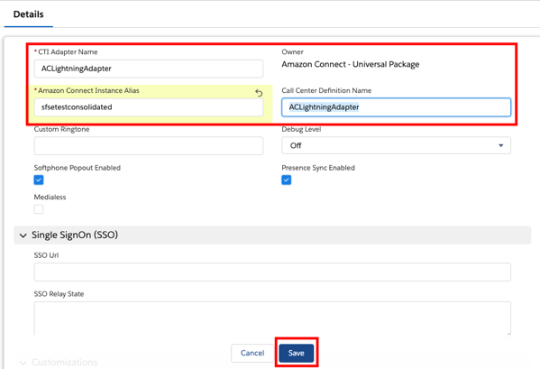

15. **Refresh** the browser

16. In the bottom left corner of the Service Console, select the CTI
    Softphone icon

17. Select the **Sign in to CCP** button. A new window will pop up.
    Enter your Amazon Connect login credentials and select **Sign In**.
    Make sure to allow Microphone access (if asked by browser)
    **NOTE:** At this point, this process will only work for Amazon
    Connect instances configured for local user storage. If you are
    configuring SAML, please follow the SAML setup process in the
    [Single Sign On Settings](/lightning/03%20Configuring%20and%20Using%20CTI%20Adapter%20Features/01%20CTI%20Adapter%20Configuration.md#single-sign-on-settings) section before
    continuing.

18. Once Login is successful, the pop-up window will automatically
    close.

19. Expand the status menu and choose Available

20. Make an inbound phone call to your Amazon Connect instance. The CCP
    will alert you to the incoming call and allow you to accept it. Once
    you do, the call will be connected

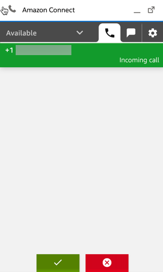

21. **End the call** and clear the contact

22. Set your agent back to **Available**

<h4 class="toc">Enhanced Agent Logout</h4>

You can configure an agent status within "Manage agent status" with
"Logout" (case-sensitive) in the status name to enable enhanced agent
logout. When the agent selects that logout status in the Contact Control
Panel, it will first set the agent in an offline status. It will then
logout the agent in Connect and the AWS Console. Here is an example of
the agent status configured within Connect:

Here is an example of an agent selecting the "Logout" status within the
Contact Control Panel:

<h4 class="toc">Validate Basic Screenpop</h4>

Next, we will add a contact to Salesforce that has your phone number
assigned to it. This will allow us to validate the basic screenpop
functionality that is provided with the CTI adapter.

1.  Select **Contacts** from the dropdown menu

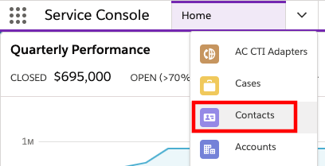

2.  Select **New** from top-right corner

3.  Complete the required fields. Make sure that your phone number is
    entered for the Phone field.

4.  Select **Save**

5.  Close the Contact tab by selecting the X next to the name of the
    contact that you just created

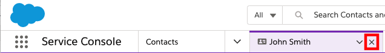

6.  **Refresh** your browser

7.  Place another phone **call** into your instance

8.  The new contact should automatically pop-up as it has been
    recognized by incoming phone number.