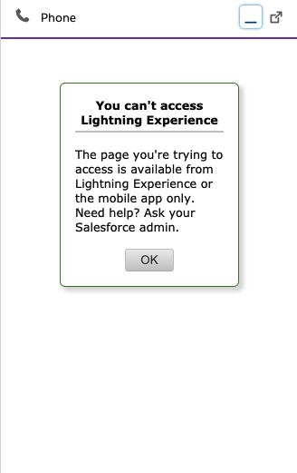

<h2 class="toc">CTI Adapter Installation Troubleshooting and Common Issues</h2>

#### Error “refused to run the JavaScript URL because it violates the following Content Security Policy directive...”

This is an allowlisting issue, please review the installation and ensure that both URLs are properly allowlisted.

#### Error “refused to frame” Visualforce page

This can happen if the customer has checked “Enable clickjack protection” on Salesforce session settings. The solution is to uncheck that. 

#### I upgraded my adapter to v5, but I don’t see the CTI Flows feature.

See the [Upgrading from an Earlier Version](02%20Installation/03%20Upgrading%20from%20an%20Earlier%20Version.md#upgrading-from-an-earlier-version) section of the installation guide.

#### I upgraded my adapter from v3 to v5 and we lost some screenpop functionality.

All screenpop functionality native to v3 now needs to be recreated using CTI Flows. Please review the [CTI Flow Examples](08%20Appendix%20D%20-%20CTI%20Flow%20Examples/01%20CTI%20Flow%20Examples.md#cti-flow-examples) for more details, all screenpop functionality from v3 has been recreated.

#### The CCP doesn’t show up in service console and I instead see the following image:

Copy the full url of the lightning adapter visualforce page into the call center.