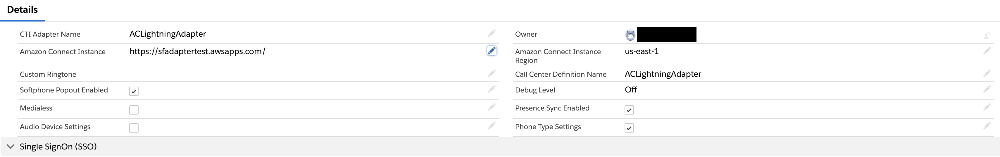
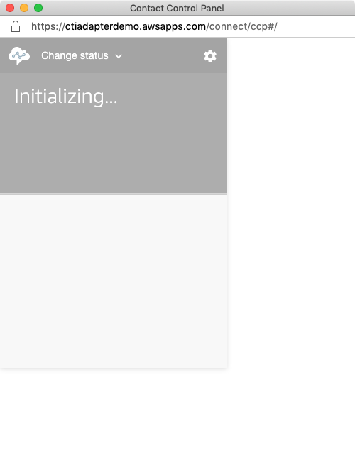

<h2 class="toc">CTI Adapter Details</h2>

The CTI Adapter configuration begins with the adapter details. These
fields provide the basic information needed to relate the Adapter to the
call center configuration in Salesforce and, ultimately, to the agents
and supervisors that will be using the platform.

<h4 class="toc">Update the CTI Adapter Details</h4>

1.  **CTI Adapter Name:** provide a unique name for this CTI adapter
    definition

2.  **Amazon Connect Instance Alias:** This was configured in a previous
    section. This is the instance alias for your Amazon Connect
    instance.

3.  **Amazon Connect Instance Region:** This is the code for the region
    that you have deployed your Amazon Connect instance to. This is
    required for the Amazon Connect chat APIs to work correctly. If you
    do not use the chat feature of Amazon Connect, this field is not
    necessary

4.  **Custom Ringtone:** This allows for overriding the built-in
    ringtone with any browser-supported audio file accessible by the
    user.

5.  **Call Center Definition Name:** This was configured in a previous
    section. This is the internal name of the Call Center configured in
    Salesforce setup. This value links the CTI Adapter to the Call
    Center, and ultimately to the agents.

6.  **Softphone Popout Enabled:** Salesforce supports softphone pop out
    in Console and Lightning Experience modes. When the softphone is
    popped out, it opens in a new browser window external to the
    Salesforce UI. This is helpful in use cases where the call controls
    are regularly needed but the agent also needs full access to the
    entire console.

7.  **Debug Level:** For future use

8.  **Medialess:** Amazon Connect supports running in VDI environments,
    however best practice is to send the actual audio stream via a
    separate CCP. Selecting the medialess option will configure the
    Salesforce CCP to run in medialess mode, which provides the data
    that Salesforce needs for screenpop while the audio is streamed to a
    local CCP.

9.  **Presence Sync Enabled:** This setting allows the adapter to use
    the presence rules to sync state from Amazon Connect to Salesforce
    Omni-Channel.

<h3 class="toc">Single Sign On Settings</h3>

The Amazon Connect CTI Adapter supports single sign on(SSO) via SAML
integration. This allows customers that use a SAML provider for
authentication into Amazon Connect. You will need the SSO URL for your
provider and the Relay State settings for your Amazon Connect instance.

For general information on configuring SAML for Amazon Connect, please
refer to: [Amazon Connect Administrator Guide: Configure SAML for
Identity Management in Amazon
Connect](https://docs.aws.amazon.com/connect/latest/adminguide/configure-saml).

If you wish to use **Salesforce** as your identity provider for Single
Sign On, please follow the setup instructions in [Appendix B - Configuring Salesforce as Your Identity Provider](/lightning/06%20Appendix%20B%20-%20Configuring%20Salesforce%20as%20Your%20Identity%20Provider/01%20Configuration.md).

For information about configuring specific SAML providers to work with
Amazon Connect:

-   [AWS Single
    Sign-On](https://aws.amazon.com/blogs/contact-center/enabling-federation-with-aws-single-sign-on-and-amazon-connect/)

-   [Okta](https://aws.amazon.com/blogs/contact-center/configure-single-sign-on-for-amazon-connect-using-okta/)

Once you have your SAML integration working with Amazon Connect, you
will need to create the Amazon Connect Single Sign On URL and validate
that it works correctly, then configure the Lightning CTI adapter and
login the agent.

<h4 class="toc">Identify the SSO URL components</h4>

In order to authenticate with Amazon Connect, you need your IdP login
URL from your SAML provider and a relay state URL that will redirect the
authenticated user to your Amazon Connect instance.

Your IdP Login URL will resemble the following (Salesforce is shown):
<pre>https://m******run-dev-ed.my.salesforce.com/idp/login?app=0sp0N000000Caid</pre>

The 'RelayState' will be in the following format:

<pre>https://console.aws.amazon.com/connect/federate/<b>{InstanceId}</b>?destination=%2Fconnect%2Fccp</pre>

Please note that "console.aws.amazon.com" refers to US-East-1 region (N.
Virginia). If your Amazon Connect instance is in a different region,
please use the region Console URL. For example:

<pre>https://us-west-2.console.aws.amazon.com/connect/federate/<b>{InstanceId}</b>?destination=%2Fconnect%2Fccp</pre>

<h4 class="toc">Configure the CTI Lightning Adapter in Salesforce</h4>

Now we are ready to complete the last step in the configuration process:
Adding the SSO settings to the Lightning Adapter. This will configure
the adapter to authenticate via SSO and redirect to the Amazon Connect
Contact Control Panel once authentication completes.

1.  Log in into your Salesforce org and go to the **Service Console**

2.  Expand the **navigation menu** by selecting the down arrow and
    choose **AC CTI Adapters**.

3.  Select **ACLightningAdapter**

4.  Scroll down to the Single SignOn (SSO) section and choose the pencil
    icon of either field to edit

5.  For the SSO Url, paste your IdP login URL up to the first question
    mark (if one exists). A couple of examples are provided:
    Salesforce:
    <pre>https://m******run-dev-ed.my.salesforce.com/idp/login?app=0sp0N000000Caid</pre>
    Microsoft ADFS:
    <pre>https://sts.yourcorp.com/adfs/ls/idpinitiatedsignon.aspx</pre>

6.  Paste this portion of the URL into the **SSO Url** field

7.  For the SSO Relay State:
    IF you had a question mark in your login URL, paste everything AFTER
    the question mar into the SSO Relay state field, then add
    &RelayState= to the end, and append your relay state URL.
    For example:
    <pre>app=0sp0N000000Caid&RelayState=https://console.aws.amazon.com/connect/federate/<b>{InstanceId}</b>?destination=%2Fconnect%2Fccp</pre>
    IF you did not have a Question Mark, then enter &RelayState= into
    the SSO Relay State field and append your relay statue URL to it.
    For example:
    <pre>&RelayState=https://console.aws.amazon.com/connect/federate/instanceId?destination=%2Fconnect%2Fccp</pre>

8.  Example of a completed SSO section (Salesforce is shown)

9.  Choose **Save**

10. **Refresh** your browser to make the changes take effect

    a.  **NOTE:** If you receive a blocked popup warning, select the
        warning and change the setting to always allow popups from your
        Salesforce org, then refresh the browser again

11. After a few seconds, a new window should pop up for a moment. This
    window is performing the authentication and setting your session
    cookie. Once it does this, it will close automatically.

12. Once the authentication window closes, select the **phone icon** in
    the console toolbar to open the CCP
    Note: You may also receive popups to allow notifications and
    microphone access. Please accept both.

13. You should now see the authenticated and logged in CCP

14. SSO Configuration is complete
