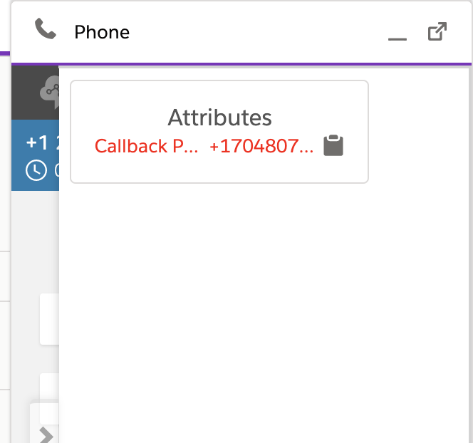
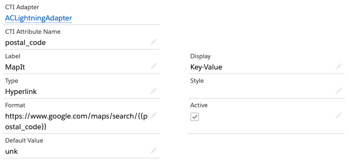
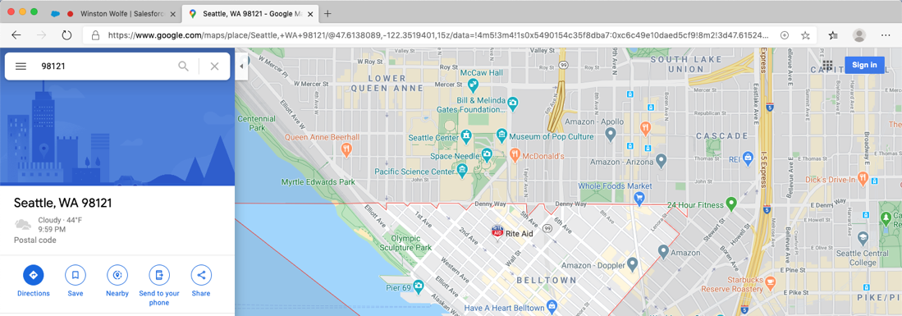
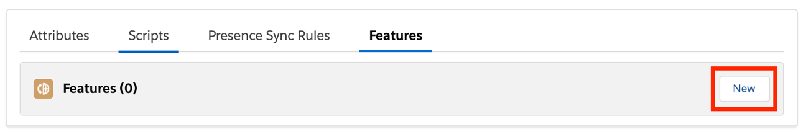
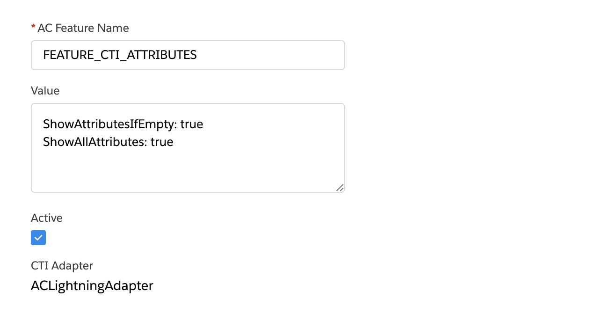

<h2 id="attributes" > Attributes </h2>

CTI Attributes provide the ability to reference and display contact
attribute data within the Amazon Connect Contact Control Panel (CCP).
This allows for easy access to data or URLs that may be necessary for
agents to perform tasks external to Salesforce. Adding attributes does
not import data directly into Salesforce. Instead, it is simply
available in the CCP for the life of the contact.

### Attribute Properties 

When configuring CTI attributes, you will need to complete the
configuration with the following information:

-   **CTI Attribute Name:** the user-friendly name that will identify
    this attribute configuration. This is not the name or key of the
    attribute itself.

-   **Label:** will be displayed in the CCP as the label for the
    attribute value.

-   **Display:** indicates how this attribute should be displayed.
    Options are:

    -   --None--: this attribute will not be displayed, however it will
        be available for use. Typically, this is used to define
        attributes that will be used in URLs.

    -   Key-Value: the attribute label and value will both be displayed
        as a key-value pair

    -   Key: only the label is displayed. This can be used to create
        sections in the attribute list. For example, you could have an
        "Address" label followed by individual attributes for street,
        city, state, country, postal code, etc

    -   Value: only the value is displayed. This can be used when
        displaying several values under one section or when displaying a
        URL that needs no label.

-   **Type:** indicates if this is a text or URL attribute

-   **Style:** allows you to specify a CSS style rule for the display of
    this attribute. The style will apply to both the label and the
    value.

-   **Format:** the format allows you to define which contact attributes
    will be used in the value of this CTI attribute. Contact attributes
    are referenced by their key name enclosed in double curly braces.
    For example, an Amazon Connect contact attribute of accountId would
    be referenced as {{accountId}}.

-   **Active (checkbox):** indicates if this CTI attribute is active

-   **Default Value:** value to be displayed if the contact attribute
    referenced is not found

Once you set the CTI attributes, you access them by choosing the
appropriate icon during a connected contact

### CTI Attribute Example Walkthrough

Since there are endless use cases for CTI attributes, this guide will
walk through a couple examples that show you how both text and hyperlink
based attributes are configured, presented, and used. These examples are
not intended to remain in your configuration and are instead designed to
provide you with the experience of configuring a functional attribute.

#### Adding a Text-based CTI Attribute

In this example, we will walk through creating a new CTI Attribute based
on a contact attribute named "phone_number" and add it to the CCP. In
our scenario, the contact flow has set this attribute using input from
the customer to indicate their phone number of record. In order for this
example to work, your contact flow must also set a contact attribute
named "phone_number"

1.  Log in into your Salesforce org and go to the **Service Console**

2.  Expand the **navigation menu** by selecting the down arrow and
    choose **AC CTI Adapters**.
    

3.  Select **ACLightningAdapter**

4.  Scroll down to the **Attributes** section and select New

5.  Provide a **CTI Attribute Name** value, for example: customer_phone

6.  Provide the **Label** name, for example: Callback Phone

7.  Select the **Display** option, in this case: Key-Value

8.  Select Text as the **Type**

9.  For **Style**, enter the following: color: red

10. In the **Format** field, enter {{phone_number}} to reference the
    incoming contact attribute

11. Set **Default Value** to unk

12. Choose Save

13. Refresh your browser

14. Place a new call into your Amazon Connect instance and accept the
    call as an agent

15. Once the call is connected, select the text attribute icon to expand
    the CTI Attributes
    

16. Note the Style formatting. Also note that you can quickly copy the
    content of the attribute by selecting the clipboard icon.

17. Disconnect the contact.

#### Adding a Hyperlink-based CTI Attribute

In this example, we will walk through creating a new hyperlink CTI
Attribute that incorporates a contact attribute named "postal_code" and
add it to the CCP. In our scenario, the contact flow has set this
attribute using a data query into Salesforce. In order for this example
to work, your contact flow must also set a contact attribute named
"postal_code"

1.  Log in into your Salesforce org and go to the **Service Console**

2.  Expand the **navigation menu** by selecting the down arrow and
    choose **AC CTI Adapters**.
    

3.  Select **ACLightningAdapter**

4.  Scroll down to the **Attributes** section and select New

5.  Provide a **CTI Attribute Name** value, for example: postal_code

6.  Provide the **Label** name, for example: MapIt

7.  Select the **Display** option, in this case: Key-Value

8.  Select Hyperlink as the **Type**

9.  Leave **Style** blank

10. In the **Format** field, enter
    <pre>https://www.google.com/maps/search/{{postal_code}}</pre>
    to append the incoming contact attribute to the URL

11. Set **Default Value** to unk

12. Choose Save

13. Refresh your browser

14. Place a new call into your Amazon Connect instance and accept the
    call as an agent

15. Once the call is connected, select the hyperlink attribute icon to
    expand the CTI Attributes
    

16. Select the URL and observe the page load

17. Disconnect the contact.

### CTI Attribute Additional Features

#### Enabling CTI Attribute Additional Features

The additional CTI Attribute features allow you to further customize CTI
Attributes.

1.  In Service Console, navigate to your CTI Adapter

2.  Scroll down to the features section of your AC CTI Adapter and
    select **new**

3.  Set the AC Feature Name to **FEATURE_CTI_ATTRIBUTES**

4.  Fill the value text box to contain the following settings:

    a.  **ShowAttributesIfEmpty** (Boolean, default true): show
        attributes text box when contact has no attributes
        

        
    b.  **ShowAllAttributes** (Boolean, default false): show all attributes, including attributes with no values

5.  Select **Save**
