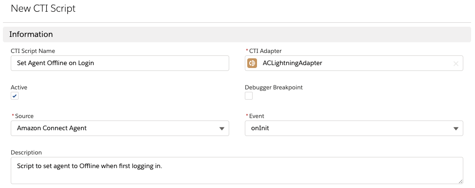
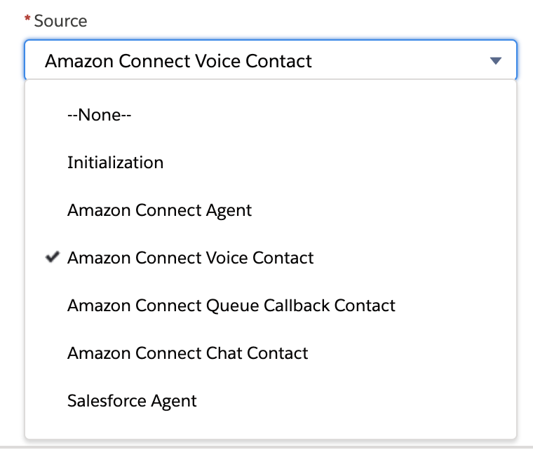
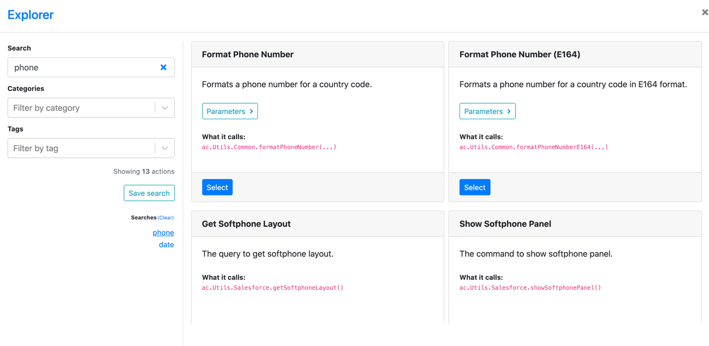
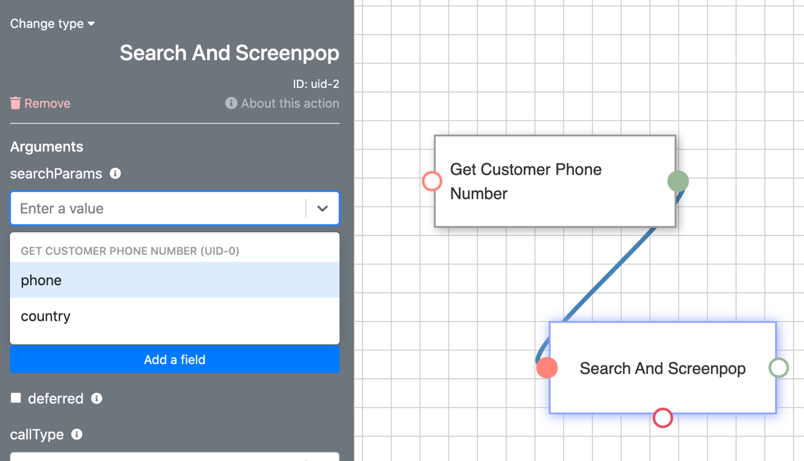

<h2 id="cti-flows" > CTI Flows </h2>

The CTI Adapter provides a mechanism to customize the behavior of the
adapter based on your business needs without needing to edit the
underlying Visualforce pages, which could negatively impact overall
adapter function. This is accomplished through CTI Flows.

A CTI Flow consist of "actions" that represent an API call to parts of
Salesforce or Amazon Connect API. Like a JavaScript function, each
action can take inputs and provide outputs, or returns values, that you
can use from other actions.

To create a new CTI Flow, log in into your Salesforce org and go to the
**Service Console.** Expand the **navigation menu** by selecting the
down arrow and choose **AC CTI Adapters**.

Select **ACLightningAdapter.** Scroll down to the **CTI Flows** section
and select New to create a new CTI Script.

Provide a user-friendly name in the **CTI Flow Name** field. And click
**Save**.

This will take you to a form where you can fill in name and adapter of
the CTI Flow. There are a couple of fields that you may be unfamiliar
with: **Source** and **Event**.

Let's look at **Source** field first.

You can think of Source as the "origin" of the CTI Flow. There are
currently 7 sources: Initialization, an Agent on Connect, Voice Contact
on Connect, Queue Callback Contact on Connect, Chat on Connect,
Salesforce Agent or Salesforce UI.

Each source comes with a set of events that you can hook into, i.e. your
CTI Flow will be executed when one of these events fire. Typically, you
will have only one flow for a combination of a source and an event. (You
can find out more about sources and events in [Cti Flow Sources And Events](https://github.com/amazon-connect/amazon-connect-salesforce-cti-staging/blob/main/lightning/07%20Appendix%20C:%20CTI%20Flow%20Sources%20and%20Events/01%20CTI%20Flow%20Sources%20and%20Events.md).)

For the purposes of this example, we selected **Amazon Connect Voice
Contact** source and **onConnecting** event. Now click Save and on the
next page scroll down till you find the **CTI Flow** section.

Let's build a CTI Flow that opens a screenpop in Salesforce when a voice
call comes.

You can start using by dragging the item called **CTI Block** from the sidebar in the Main Menu over the stage,
which is marked by a grid pattern.

When you drop the block, you will see a modal titled **Explorer**. This
modal contains a list of actions you can choose from.

In the **Search** field, search for **Phone** and Select the action
called **Get Customer Phone Number** from the results on the right.

You should now see a block on the stage for the action you selected, and the sidebar will display some
information about this action, including its return value.

(Note: If you'd like to change the label of the action, doubleclick on
it. This will open a text editor. Make your changes and when you're
finished click outside the node to save your label.)

Some actions can be configured using input fields to provide arguments
to function calls, as well. This action does not have any input fields,
and returns two values ---- **phone** and **country**.

Now let's drag another CTI Block over the stage and find an action
called **Search and Screenpop**.

Connect these blocks by clicking the green socket (green means "done")
on **Get Customer Phone**, which will display a blue line that tracks
your mouse cursor around the stage.

Now, click on the pink socket, i.e. the **input** socket, which is to
the left of the **Search and Screenpop** block. If the connection is
successful, the sockets fill turn into a solid color and the blue line
will connect them. (There are some restrictions on which sockets you can
connect together. For example, you cannot connect output of an action to
its own input socket or connect two inputs.) If you are not happy with
this connection, you can hover over it and double click to remove.

Now we'd like to get the phone number of the customer and use it in
**Search and Screenpop**. Here is a tip: if two actions are connected,
you can use the return values of the first action in the input fields of
the next action. (You can even use the return values of actions
connected to the last action, and the ones connected to that, and so
on.)

This action has only two options, and we want to use the one called
"phone" for this field.

If you want to enter a custom input value, you can type that, and select
**Add New Value** from the dropdown.

And make sure to set **callType** to "inbound." Finally, add the
**Start** and **End** nodes and connect everything together.

When you're finished, click **Save** in the sidebar. That's it. You
created your first CTI Flow.

To test your flow, go to your **Service Console**, and make a call from
a number that is in the profile of a Contact. As the call is displayed
in your CCP dashboard, Salesforce will pop open the contact of the
caller in a separate tab.