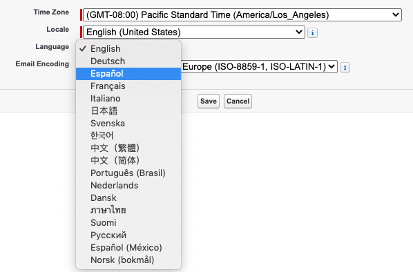
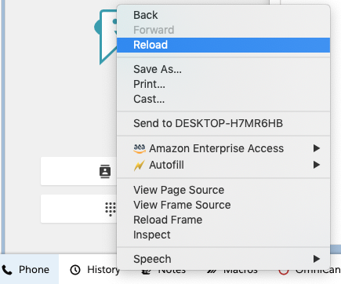

Localization
=========

Prerequisites
-------------
CTI Adapter will use Translation Workbench to maintain translated values for metadata and data labels in your Salesforce org. In order for that to work, you need to enable Translation Workbench in your org. 

1. From Setup, in the Quick Find box, enter Translation Language Settings, and then select Translation Language Settings.

2. On the welcome page, click Enable.

Setting you preferred language
-------------

Starting from v5.6, Amazon Connect Salesforce CTI adapter is localized in nine new languages: Spanish, French, Brazilian Portuguese, Korean, Italian, German, (Simplified/Traditional) Chinese, and Japanese. 

Change the language by selecting the username in the top right corner, then click on "My Settings".

On the setting page on the left panel go to "Personal" and then select "Language & Time Zone".

You can then select your preferred language. Note that CTI adapter only have nine languages built within the package. 

Click save and the page will reload. That's it. You can check in other pages to see if it actually applies your change. For example here is a screenshot of CTI Flow Editor in Spanish.

Click on Phone pannel on the bottom to see if CCP has been localized. If not right click on CCP and reload.

Additional Notes
-------------

Please note that not all fields can be localized to different languages due to a couple reasons. Here are places that cannot be localized:

* Dashboard. Salesforce dashboards do not support localization.

* Flexipages. This means the page with tabs that you can find in AC CTI Adapter page in lightning. 

* Reports. This is a missing functionality in Salesforce.