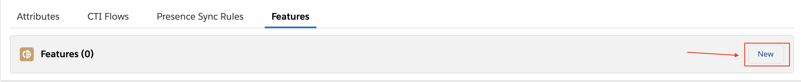
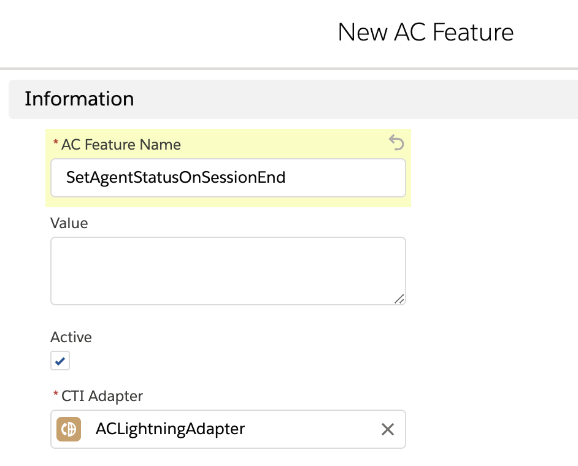
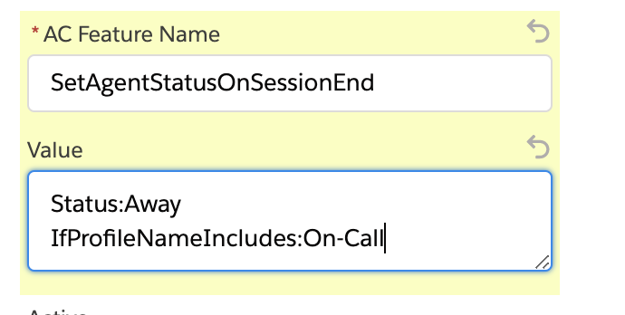
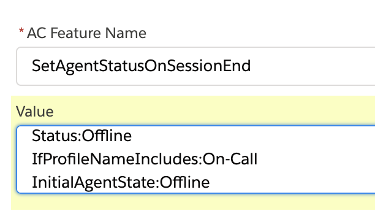

<h2 class="toc">Set Agent Status on Session End</h2>

This feature automatically sets the status of the agent to "Offline" –– or to any status you choose –– when the agent closes all his Salesforce tabs.

You can configure this feature by heading to the feature panel on your CTI Adapter and clicking new.

Then for "AC Feature Name", enter: `SetAgentStatusOnSessionEnd`

You can optionally specify which status the agents should be changed to when they end the session. By default, this is "Offline," but you can configure it using the `Status` setting of the feature.

When turned on, the feature will apply to all agents. If you'd rather have it apply to a small subset, you can configure `IfProfileNameIncludes` setting.

Now only the agents that have "On-Call" in their Connect routing profile name will be shown as "Offline" when they end their session.

As long as "On-Call" is in the profile name of the agent, this will work. This setting can accept multiple, comma-separated profile names, as well.

When your agents log back in, they will be shown as "Available" by default. If you'd like to control which status to set your agents, you can configure it with `InitialAgentState` setting.

Note that this feature does not work with Salesforce Pop-Out utilities. This means that it won't be working if CCP is popped out from utility bar. This is because the pop-out window is a different window managed by Salesforce and we are not able to track any session on that window.
