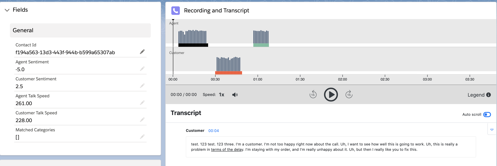

<h2 class="toc">Contact Lens</h2>

CTI Adapter now gives you access to your post-call Contact Lens data on your Salesforce instance. To configure this feature, you must have installed and configure the AWS Serverless application.

Three or four minutes after the call, a new Contact Channel Analytics record is created with the recording url with only the call recording. In another three minutes, this record is updated with Contact Lens recording, transcript and other metadata.

The new record is also associated automatically with any Case and Salesforce Contact that are already in the system through the Amazon Connect contact id. This means that you will be able to configure your case record page with a related list that lists all the calls related to a case.
