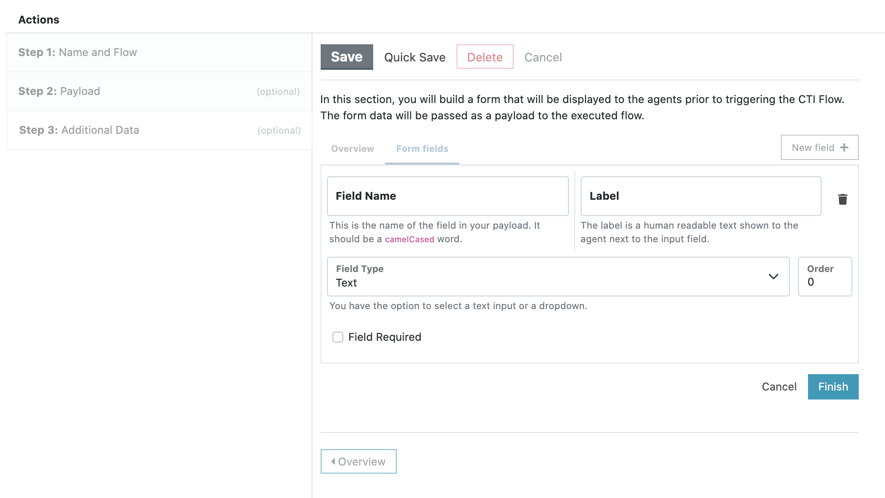
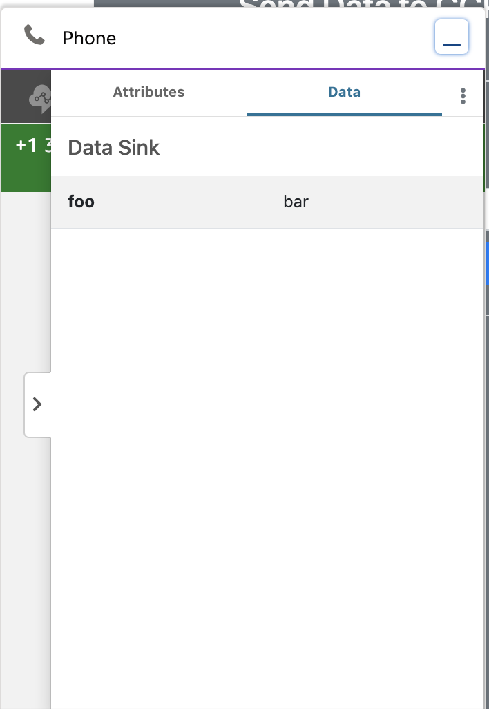
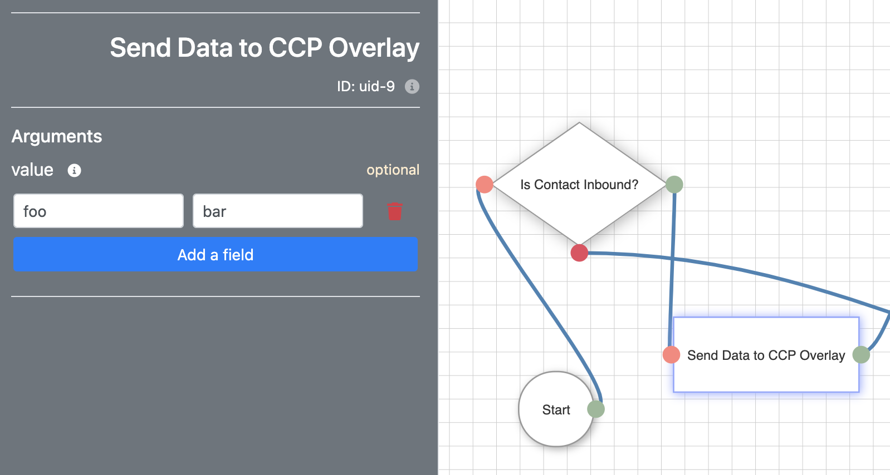

<h2 class="toc">CTI Actions</h2>

CTI Actions allow your agents to trigger CTI Flows with the push of a button. You can configure a CTI Action the CCP Element Editor page.

Make sure that you have created a CTI Flow and it uses the source "CTI Action." Only these CTI Flows will be displayed in the dropdown field.

You can optionally specify a payload to pass to the CTI Flow. This payload can be used in your CTI Flow. Another option is to allow your agents to enter additional data about the customer or the nature of the call. The CCP Element Editor gives you the ability to add form fields into your form as well.

### CCP Overlay

The Actions panel in the CCP Overlay drawer displays the CTI Actions, where your agents can have easy access to them as they are talking to customers.

If an action requires additional input by the agent, its name will be followed by an arrow and when the agent clicks on this item, it will open a form you have configured.

If not, it will be shown with an "Execute" button next to its name.

### Receiving Data from CTI Flows

Just as your agents can send data to the CTI Flow, they can receive data as well. When a CTI Flow sends some information to the CCP overlay, it will be displayed in the Data panel.

This is what your block will look like in your CTI Flow.

### Upgrading from an earlier version

If you are upgrading from an earlier version of CTI Adapter, there are a few additional things you need to do.

1. Go to the Setup section and search for Object Manager.
2. In Object Manager section, search for “AC CTI Script”
3. Open up the first item on the list: AC CTI Script
4. On the left sidebar, click on Page Layouts
5. Click on Page Layout Assignment
6. On the next page, click on Edit Assignments
7. Click on the grey bar at the top of the table to select all rows.
8. Open the Page Layout to Use dropdown and select _AC CTI Flow Layout – April 2021_.
9. Click Save and go back to Page Layouts.
10. Click on the dropdown next to the item labelled AC CTI Script Layout and click Delete.
11. Confirm Yes in the next dialogue where you will be asked “Are you sure?”
12. If you see a screen titled Deletion Problems, find and click Delete.
13. You will be asked which layout you want to replace it with. Select _AC CTI Flow Layout – April 2021_ and click Replace.
