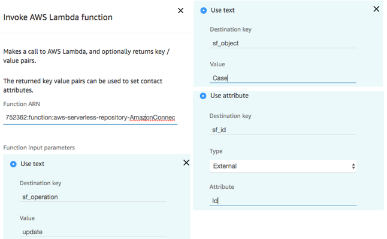
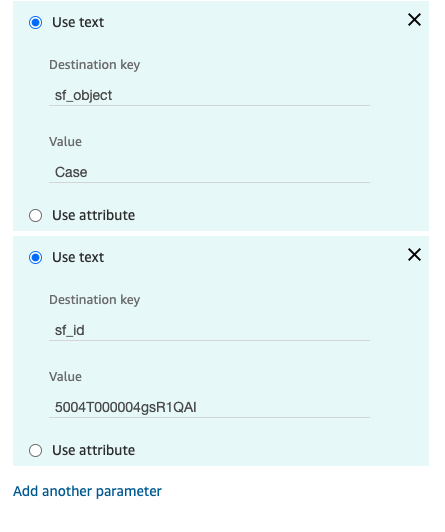
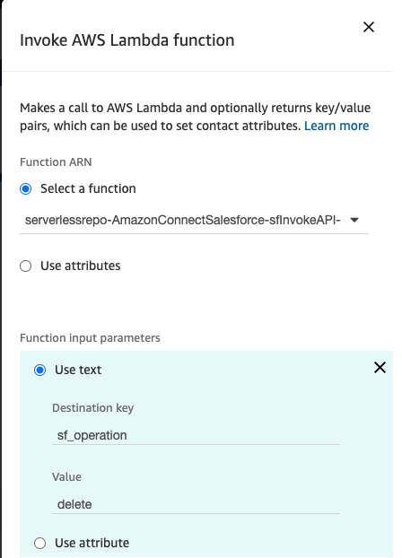
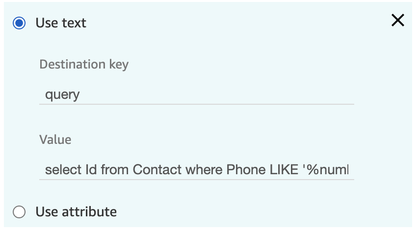
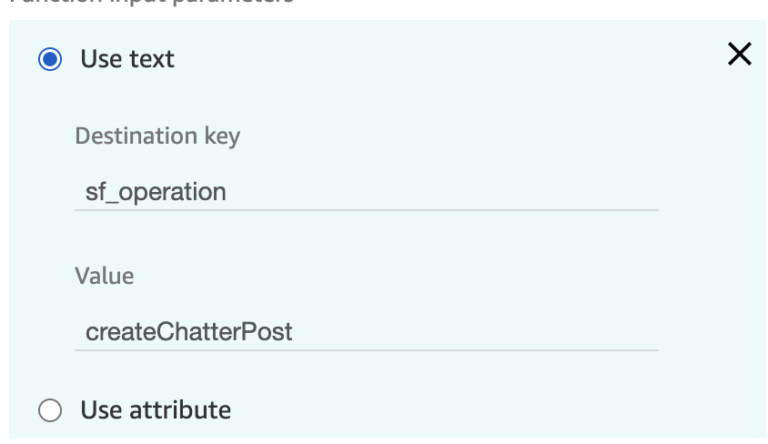
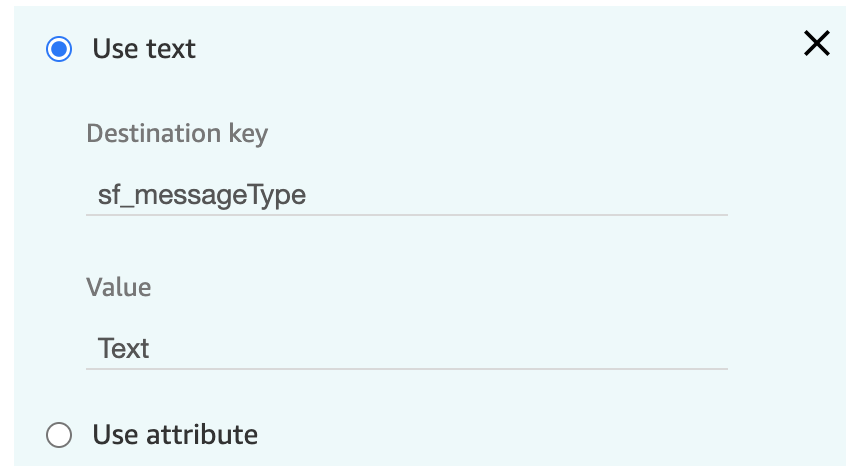
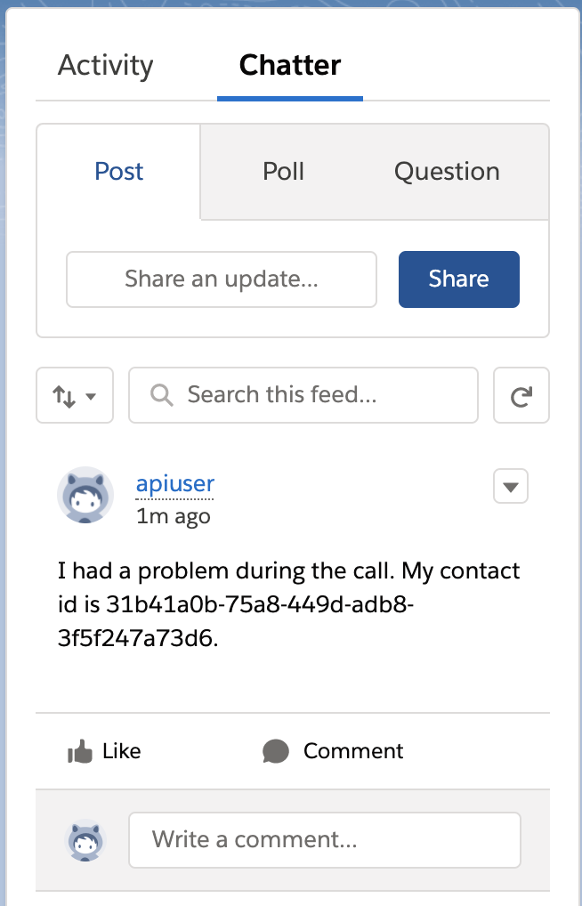
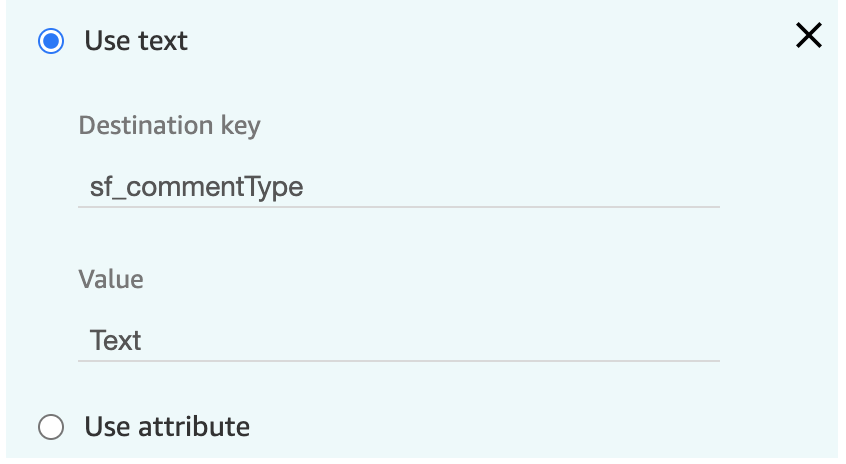
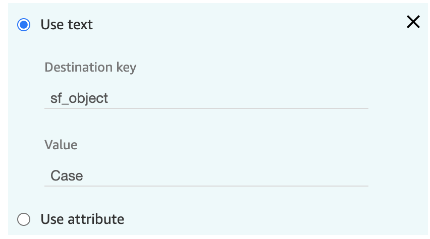
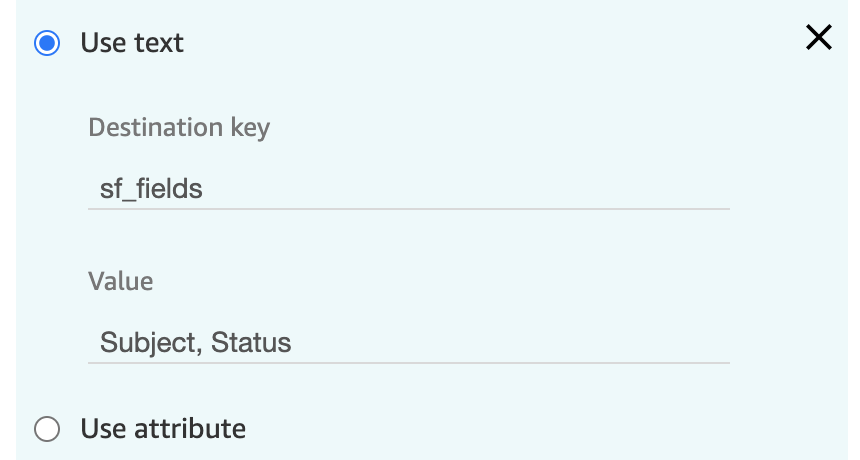

<h2 class="toc">Accessing the Salesforce API from Amazon Connect Contact Flows Using AWS Lambda</h2>

The most commonly used feature of the AWS Serverless Application
Repository for Salesforce is accessing/updating Salesforce data using
the sfInvokeAPI Lambda function. This function allows an Amazon Connect
contact flow to perform the following operations against your Salesforce
org:

-   **Lookup:** queries Salesforce for objects based on the parameters
    passed to it

-   **Create:** creates a Salesforce object based on the parameters
    passed to it

-   **Update:** updates a Salesforce object based on the parameters
    passed to it

-   **Phone Lookup:** uses Salesforce Object Search Language (SOLS) to
    construct text-based search queries against the search index, which
    gives significant performance improvement when searching phone
    number fields.

-   **Delete:** deletes a Salesforce object based on the parameters
    passed to it

-   **Query:** executes a Salesforce Object Query Language (SOQL) query
    on the Salesforce instance. Can return multiple entries.

-   **QueryOne:** executes a Salesforce Object Query Language (SOQL)
    query on the Salesforce instance. Returns result only when one entry
    is returned from the query.

-   **CreateChatterPost:** creates a chatter post.

-   **CreateChatterComment:** creates a chatter comment.

-   **Search:** performs a search against the Salesforce instance, returning all results.

-   **SearchOne:** performs a search against the Salesforce instance, returning at most one result.

**NOTE:** naming of the Lambda function will vary based on template
data, but sfInvokeAPI will always be a part of the name.

When you invoke this Lambda function from your contact flows, you will
need to pass along parameters that inform the function as to which
Salesforce operation you wish to execute, as well as pass along any
required parameters. Depedning on your use case, this can require
reference to the [Salesforce REST
API](https://developer.salesforce.com/docs/atlas.en-us.api_rest.meta/api_rest/resources_list.htm)
or the [Salesforce Connect REST
API](https://developer.salesforce.com/docs/atlas.en-us.chatterapi.meta/chatterapi/intro_what_is_chatter_connect.htm)
documentation. The core parameters are:

-   **sf_operation:** specifies with operation to run. Options are
    lookup, create, update, phoneLookup, query, queryOne,
    createChatterPost, createChatterComment

-   **sf_object:** defines what type of object you are referencing.
    Examples include Case, Contact, Task, etc.

-   **sf_fields:** the fields you want to receive back from Salesforce
    when an operation completes successfully

-   **sf_id:** the unique identifier for a Salesforce object. Typically
    used in update operations

-   **sf_phone:** contains the phone number used to search when
    performing a phone lookup

<h3 class="toc">Salesforce Lookup</h3>

This operation is invoked by setting **sf_operation** to **lookup**. In
this case, the Lambda function queries Salesforce for objects based on
the parameters passed to it. For lookup, the following parameters are
required:

-   sf_object

-   sf_fields

Any additional parameters passed will be evaluated as conditional
arguments for the lookup.

Note that this operation only returns the first item of the query
results. If you want to have all results returned from Salesforce, set
**sf_operation** to **lookup_all**.

In the contact flow example below, we are looking for a specific case
based on customer input.


This operation returns a response of:

```json
{
    "Id": "5006g00000AaIs7AAF",
    "sf_count": 1
}
```

<h3 class="toc">Salesforce Create</h3>

This operation is invoked by setting **sf_operation** to **create**. In
this case, the Lambda function creates a Salesforce object based on the
parameters passed to it. For create, the following parameters are
required:

-   sf_object

-   Specify additional parameters for the Salesforce object to be
    created. Please be sure to include all parameters required to create
    the Salesforce object.

In the contact flow example below, we creating a new case based on
customer input.


This operation returns a response of:

```json
{
    "Id": "5006g00000BLqurAAD"
}
```

<h3 class="toc">Salesforce Update</h3>

This operation is invoked by setting **sf_operation** to **update**. In
this case, the Lambda function updates a Salesforce object based on the
parameters passed to it. For update, the following parameters are
required:

-   sf_object

-   sf_id

-   Specify additional parameters for the Salesforce object to be
    created. Please be sure to include all parameters required to create
    the Salesforce object.

In the contact flow example below, we are updating a specific case.



This operation returns a response of:

```json
{
    "Status": "204"
}
```

The "204" status indicates a success.

<h3 class="toc">Salesforce Phone Lookup</h3>

This operation is invoked by setting **sf_operation** to
**phoneLookup**. In this case, the Lambda function uses Salesforce
Object Search Language (SOLS) to construct text-based search queries.
For phoneLookup, the following parameters are required:

-   sf_phone

-   sf_fields

In the contact flow example below, we look for a customer by phone
number.


This operation returns a response of:

```json
{
    "Id": "5006g00000BLqurAAD",
    "sf_count": "1",
    "Name": "Jim Smith"
}
```

<h3 class="toc">Salesforce Delete</h3>

This operation is invoked by setting **sf_operation** to **delete**. In
this case, the Lambda function deletes a Salesforce object based on the
parameters passed to it. For delete, the following parameters are
required:

-   sf_objejct

-   sf_id

In the contact flow example below, we deleting an existing case based on
customer input.




This operation returns a response of:

```json
{
    "Response": "None"
}
```

<h3 class="toc">Salesforce query</h3>

This operation is invoked by setting **sf_operation** to **query**. In
this case, the Lambda function uses Salesforce Object Query Language
(SOQL) to conduct a query against the Salesforce instance. For query,
the following parameter is required:

-   query

Any additional parameters will replace text values in the original query
so that queries can be dynamic based on values stored within the contact
flow. For example, the parameter set:

-   query: "select field from object"

-   field: "Id"

-   object: "Task"

Will result in the query: "select Id from Task".

In the contact flow example below, we look for a customer by phone
number.




(full text of the value is "select Id from Contact where Phone LIKE
\'%number%\'")


This operation returns a response of:

```json
{
    "sf_records": [
        { "Id": "00303000001RZfIAAW" }
    ],
    "sf_count": 1
}
```


<h3 class="toc">Salesforce queryOne</h3>

This operation is invoked by setting **sf_operation** to **queryOne**
(case sensitive). In this case, the Lambda function uses Salesforce
Object Query Language (SOQL) to conduct a query against the Salesforce
instance, returning a result only when one record is returned from the
query. For query, the following parameter is required:

-   query

Any additional parameters will replace text values in the original query
so that queries can be dynamic based on values stored within the contact
flow. For example, the parameter set:

-   query: "select field from object"

-   field: "Id"

-   object: "Task"

Will result in the query: "select Id from Task".

In the contact flow example below, we look for a customer by phone
number.


(full text of the value is "select Id from Contact where Phone LIKE
\'%number%\'")


This operation returns a response of:

```json
{
    "Id": "00303000001RZfIAAW",
    "sf_count": 1
}
```

<h3 class="toc">Salesforce createChatterPost</h3>

This operation is invoked by setting **sf_operation** to
**createChatterPost** (case sensitive). In this case, the Lambda
function uses the Salesforce Connect REST API to create a chatter post
(see
[here](https://developer.salesforce.com/docs/atlas.en-us.chatterapi.meta/chatterapi/quickreference_post_feed_item.htm)).
For createChatterPost, the following parameters are required:

-   sf_feedElementType

-   sf_subjectId

-   sf_messageType

-   sf_message

The following parameter is optional:

-   sf_mention

(refer to the api reference for value types)

Any additional parameters will replace text values in the sf_message so
that messages can be dynamic based on values stored within the contact
flow. For example, the parameter set:

-   sf_message: "Please help me with case {{caseId}}"

-   caseId: 1234

Will result in the message: "Please help me with case 1234".

In the contact flow example below, we leave a chatter post on a contact.







(full text of the value is "I had a problem during the call. My contact
id is {{contactId}}.")


The operation returns a response of:

```json
{
    "Id": "0D503000000ILY5CAO"
}
```

See the chatter post appear attached to the Subject:



<h3 class="toc">Salesforce createChatterComment</h3>

This operation is invoked by setting **sf_operation** to
**createChatterComment** (case sensitive). In this case, the Lambda
function uses the Salesforce Connect REST to create a chatter comment
(see
[here](https://developer.salesforce.com/docs/atlas.en-us.chatterapi.meta/chatterapi/connect_resources_feed_element_capability_comments_items.htm)).
For createChatterComment, the following parameters are required:

-   sf_feedElementId

-   sf_commentType

-   sf_commentMessage

(refer to the api reference for value types)

Any additional parameters will replace text values in the
sf_commentMessage so that messages can be dynamic based on values stored
within the contact flow. For example, the parameter set:

-   sf_commentMessage: "Please help me with case {{ caseId }}"

-   caseId: 1234

In the contact flow example below, we leave a comment on a chatter post.





The operation returns a response of:

```json
{
    "Id": "0D703000000ChhNCAS"
}
```

See the chatter post appear attached to the Subject:


### Salesforce search

This operation is invoked by setting **sf_operation** to
**search** (case sensitive). In this case, the Lambda
function uses the Salesforce REST to perform a parameterized search
(see
[here](https://developer.salesforce.com/docs/atlas.en-us.api_rest.meta/api_rest/resources_search_parameterized.htm)).
For search, the following parameters are required:

-   q

-   sf_fields

-   sf_object

The following parameters are optional:

-   where

-   overallLimit

(refer to the api reference for value types)

See the below example:







The operation returns a response of:

```json
{
    "sf_records": [
        {
            "Id": "50001000001B9e6AAG", 
            "Subject": "test subject", 
            "Status": "New"
        }, 
        {
            "Id": "50001000001B9eWAAS", 
            "Subject": "test subject", 
            "Status": "New"
        }, 
        {
            "Id": "50001000001BDgiAAG", 
            "Subject": "test subject", 
            "Status": "New"
        }
    ], 
    "sf_count": 3
}
```

### Salesforce searchOne

This operation is invoked by setting **sf_operation** to
**searchOne** (case sensitive). In this case, the Lambda
function uses the Salesforce REST to perform a parameterized search
(see
[here](https://developer.salesforce.com/docs/atlas.en-us.api_rest.meta/api_rest/resources_search_parameterized.htm)).
For search, the following parameters are required:

-   q

-   sf_fields

-   sf_object

The following parameter is optional:

-   where

(refer to the api reference for value types)

See the below example:


The operation returns a response of:

```json
{
    "Id": "50001000001BIn6AAG",
    "Subject": "test subject unique", 
    "Status": "New", 
    "sf_count": 1
}
```