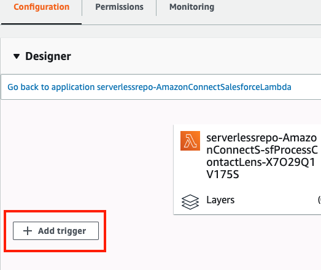
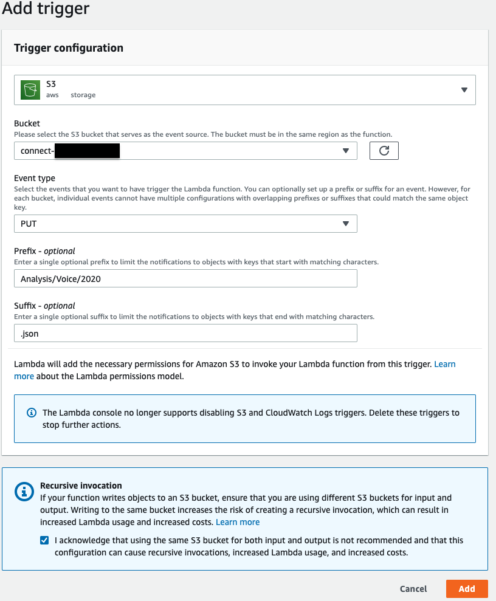
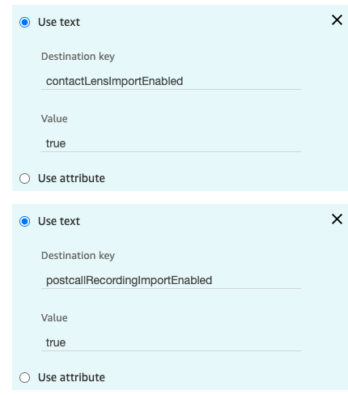

<h2 class="toc">Postcall Contact Lens Import</h2>

Contact Lens for Amazon Connect is a set of machine learning (ML) capabilities integrated into Amazon Connect. With Contact Lens for Amazon Connect, contact center supervisors can better understand the sentiment, trends, and compliance of customer conversions to effectively train agents, replicate successful interactions, and identify crucial company and product feedback. 

Contact Lens are available within your Amazon Connect instance in CTR page, and are also stored in Amazon Connect S3 bucket. With the AWS Serverless Application for Salesforce (Amazon Connect Salesforce Lambda), you can import Contact Lens data into your Salesforce org. 

<h3 class="toc">Contact Trace Record Import</h3>

Before using AWS Serverless Application (Amazon Connect Salesforce Lambda) to import Contact Lens data, you need to enable Contact Lens in Amazon Connect. More information can be found at <https://docs.aws.amazon.com/connect/latest/adminguide/enable-analytics.html>.

Once enabled during the installation of AWS Serverless Application (Amazon Connect Salesforce Lambda), Contact Lens import is activated on a call by call basis by adding a specific contact attribute. This attribute is used during Contact Lens processing to trigger the import task.

<h4 class="toc">Creating the AWS Lambda Trigger for the Contact Lens Data</h4>

1. Make sure you set **ContactLensImportEnabled** to **true** during the deployment of Amazon Connect Salesforce Lambda application.

2. Once the deployment is finished, you need to configure a trigger that invokes a Lambda function when Contact Lens output file is generated and stored in S3.

3. In a browser tab, login to the [AWS Console](https://console.aws.amazon.com/).

4. Open the [AWS Lambda Console](https://console.aws.amazon.com/lambda/home).

5. In the filter field of the AWS Lambda console, enter sfProcessContactLens and press enter to filter the list of functions.

6. Select the Lambda that includes sfProcessContactLens in the name.

7. Expand the Designer section.

8. Select Add trigger

9. In Trigger congiguration, select S3 from the dropdown list

10. Select the bucket of your Amazon Connect instace. You can find your Amazon Connect bucket name by clicking on your Amazon Connect instance alias in Amazon Connect console.

11.  Change the Event type to PUT.

12. Set the Prefix to **Analysis/Voice/2020**. Note that this might change as the date changes so you will need to update this on the first day of every new year. 

13. Set the Suffix to .json

14. The trigger configuration should now be similar to the following:

15. Select **Add**

16. If everything has been configured correctly, you should received a success message. 

<h4 class="toc">Enabling Contact Lens Import</h4>

1. Login to your Amazon Connect instance as an Administrator

2. From the left navigation, choose **Routing** then select **Contact         flows**

3.  Open the contact flow that you want to use to enable Contact Lens
    import.

4.  In you contact flow, before you transfer to queue, add a new **Set
    contact attributes** block

5. Configure the block to set two contact attributes as follows:

    **Destination key:** postcallRecordingImportEnabled 
    
    **Value**: true

    **Destination key:** contactLensImportEnabled 
    
    **Value**: true

6.  **Save** the Set contact attributes block. Make sure it is
    appropriately connected to your contact flow, and **Publish** the
    flow.

7.  Wait approximately 2 minutes to give the contact flow time to
    publish.

8.  Place a call, connect to your agent, speak for a few moments, then
    end the call. Make sure the agent exits after call work

9.  The Contact Lens data is emitted a couple of minutes after call            completion and the import happens almost immediately.