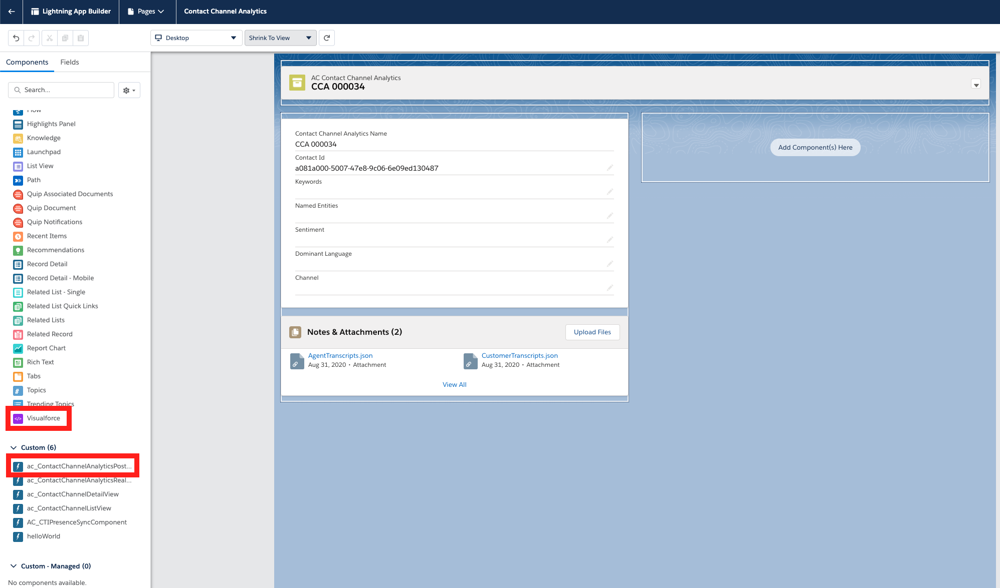
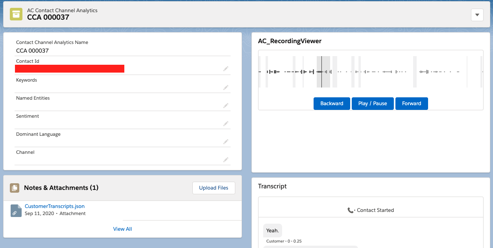

<h2 class="toc"> Setting Up Audio Recording Streaming and Transcription in Salesforce </h2>

The Amazon Connect Salesforce Integration supports audio recording
streaming playback in Salesforce. To do so, the serverless application
sets up a Cloudfront distribution that streams audio directly from the
s3 bucket that stores the call recording, and a lambda that generates
urls to the audio files through the Cloudfront distribution that expire 
after one hour.

### Cloudformation Template

To make sure that the AWS resources are set up, make sure that the
*PostcallRecordingImportEnabled* parameter is set to true in your
Cloudformation stack:


### AWS Side Setup

1. In an **admin AWS account**, navigate to "My Security Credentials" in the AWS console.


2. Under "Cloudfront Key Pairs," select **Create New Key Pair**


3. In the modal that then pops up, select **Download Private Key File**. Then, copy down the **Access Key ID**.


4. Copy and paste the contents of the private key .pem file into a text editor. Replace every newline character with a space, and then delete the last character. This is most easily done using a "find and replace" feature in your text editor.

5. Navigate to the "Secrets Manager" service. Select the **SalesforceCredentials**. 

6. Under the "Secret value" tab, select "Retrieve secret value" and then "Edit".

7. For the **CloudFrontPrivateKey** field, copy and paste the modified contents of the private key .pem file. For the **CloudFrontAccessKeyID** field, copy and paste the **Access Key Id** you recorded above. Your Secrets Manager Secret should look like the following:


Please note that your secret may also be formatted stored as a "Secret key/value" secret rather than a "Plaintext" secret; both secret types are valid.

8. Navigate to your Salesforce instance. Navigate to setup, then search for "Visualforce pages."


9. Select the **AC_RecordingViewer** visualforce page, and select "preview." Copy the url of the opened page up until ".com".

10. Navigate back to aws, to the s3 bucket where your audio recording files are stored. This s3 bucket should be the same bucket as the **ConnectRecordingS3BucketName** parameter to the serverless application.

11. In the bucket details, select the **Permissions** tab and then the **CORS configuration** tab and paste the following. Replace the AllowedOrigin with the url copied in step 9.

```xml
<?xml version="1.0" encoding="UTF-8"?>
    <CORSConfiguration xmlns="http://s3.amazonaws.com/doc/2006-03-01/">
    <CORSRule>
        <AllowedOrigin>{url copied in step 9}</AllowedOrigin>
        <AllowedMethod>GET</AllowedMethod>
        <AllowedHeader>*</AllowedHeader>
    </CORSRule>
</CORSConfiguration>
```


12. Select Save

13. Navigate to the "IAM" aws service. Select Users, then select the **sfInvokeGenerateAudioRecordingStreamingURLIAMUser** user.


14. Select the **Security credentials** tab and select the **Create access key** under the "Access Keys" section.


15. In the modal that pops up, copy down the **Access key ID** and the **Secret access key**. These keys will be used in the next section.

16. Navigate to the "Lambda" aws service. Search for term "sfgenerate" and copy down the full name of the sfGenerateAudioRecordingStreaming lambda. This will be used in the next section.


### Salesforce Side Setup

1. In Salesforce Setup, search for "Named Credentials." Select **edit** on the **AwsGenerateAudioRecordingURL** that was created by the CTI Adapter AppExchange package.


2. In the **URL** section, replace {awsRegion} with the awsRegion your serverless application resides in (for example, us-east-1), and replace {lambdaFunctionName} with the full name of the sfGenerateAudioRecordingStreaming lambda you recorded in the previous section.

3. For the **Authentication Protocol**, select AWS Signature Version 4. Fill in the **Access key ID** you recorded in the previous section as "AWS Access Key ID", the **Secret access key** as the "AWS Secret Access Key", the AWS Region, and "lambda" as the "AWS Service."

4. Select **save**.

5. In the setup search box, search for "Permission sets". Select the "AC_CallRecording" permission set.

6. Select "Manage Assignments".


7. Select "Add Assignments". Add the users that should have access to the audio recordings and select "assign".


8. In the setup search box, search for "Object Manager".

9. Select the "AC Contact Channel Analytics" Object, select "Lightning Record Pages", then select "Edit".

10. From the lefthand panel, drag the **Visualforce** component and the **ac_ContactChannelAnalyticsPostTranscriptView** custom component on to the page in the desired position.



11. Select the **Visualforce** component that was dragged onto the screen. In the righthand panel that shows up, select the dropdown under "Visualforce page name" and select **AC_RecordingViewer**.

### Listening to an audio recording

1. Navigate back to the service console.


2. Select the dropdown menu, and select "AC Contact Channel Analytics"


3. Select a record. Depending on when the record was created, you may have to create a new record via a new call into the CCP.

