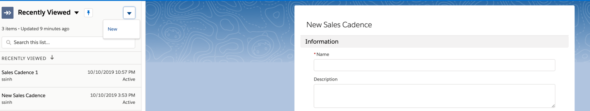
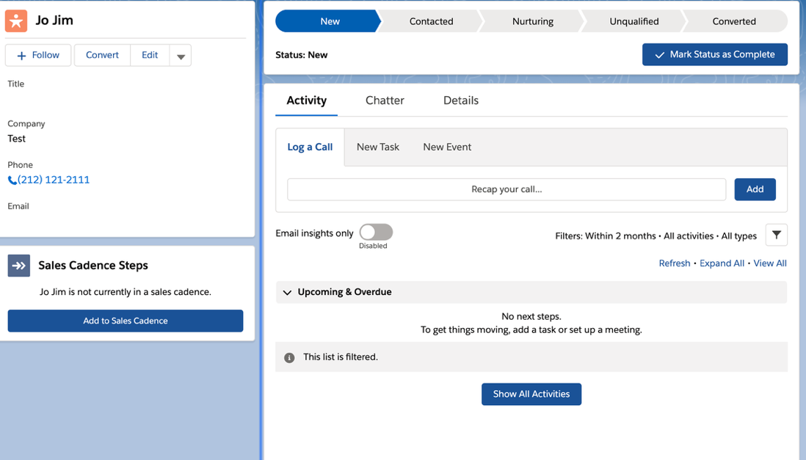
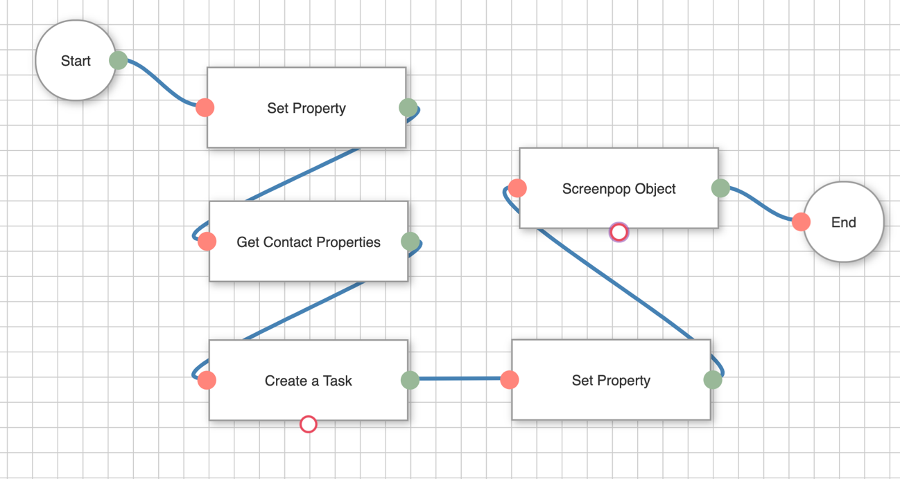

<h2 class="toc">High Velocity Sales</h2>

<h3 class="toc">What is High Velocity Sales?</h3>

Salesforce HVS (HVS) is a process for your inside sales team to follow a
repeatable pre-defined sales cadence for your business. It enables sales
managers and representatives to work on a prioritized list of prospects
and follow best sequence of sales outreach activities as defined by your
sales process.

<h3 class="toc">Enabling the Integration with High Velocity Sales</h3>

In order to make HVS works for your connect users, you must enable High
Velocity Sales in your Salesforce Org.

<h4 class="toc">Enable High Velocity Sales</h4>

1.  From Setup, enter High Velocity Sales in the Quick Find box, then
    select High Velocity Sales.

2.  Toggle "Enable High Velocity Sales Features" from disable to enable
    state

<h3 class="toc">Call Outcomes for Branching</h3>

In this step, you can define call disposition values which can be used
to branch sales cadence to define next best action for your sales
process.

<h4 class="toc">Define Call Outcomes for Branching</h4>

1.  From Setup, enter High Velocity Sales in the Quick Find box, then
    select High Velocity Sales.

2.  Edit the Define Call Outcomes for Branching.

3.  Enter the call result values used by your org next to related call
    outcomes.

<h3 class="toc">Assign HVS permission sets to Connect Users</h3>

For creating Sales Cadence, you need to have **High Velocity Sales
Cadence Creator** permission set otherwise assign the **High Velocity
Sales User** permission set to sales users.

<h4 class="toc">Assign the permission set</h4>

1.  From Setup, enter permission Sets in Quick Find box, and then select
    Permission Sets.

2.  Select permission set, then click Manage Assignments to assign the
    permission set to users.

### Create Sales Cadence

In HVS application, you will need to create a Sales Cadence based on
Sales process

Create a Sales Cadence

1.  Choose **Sales Cadence** from navigation menu.

2.  Click the down arrow button then click **New**

3.  Enter name and description. Click **Save** button which opens
    **Sales Cadence** builder screen.

4.  Click + sign in the builder to add a step. Choose a type of step you
    want to add for your sales cadence. Once you finish adding steps,
    click the **Activate** button. Once a sales cadence is active, you
    can add leads, contact, and personal accounts to Sales Cadence.

<h3 class="toc">Assigning Prospects</h3>

You can assign a prospect to a Sales Cadence either on a prospect detail
page or through an automated flow. In this example, using prospect
detail page to assign a sales cadence.

Click **Add to Sales Cadence** button to add this prospect to a Sales
Cadence.

<h3 class="toc">Create and Map Dispositions</h3>

In this step you need to add a disposition field on Activity object and
map disposition options to what is defined in HVS call outcomes. In this
example, I am going to create a picklist field and add it to default
task page layout to track disposition value for each call.

<h4 class="toc">Create and map disposition fields</h4>

1.  Go to the Setup screen then click **Object Manager**

2.  Click **Activity Object**

3.  In Fields and Relationships section select **New**

4.  Select a picklist field and choose **Next**

5.  Enter require information and add HVS call outcomes as picklist
    options.

6.  Select all default options and add this filed on Task page layout.
    (If there is already a field called **Call Result** on Task Page
    layout then remove it from the page layout.)

7.  Choose **Save**

<h3 class="toc">Setup CTI Flows for High Volume Sales</h3>

Next you will need to create a new set of CTI Flows for High Volume
Sales.

<h4 class="toc">Configuring the CTI Flow</h4>

1.  Log in into your Salesforce org and go to the **Service Console**

2.  Expand the **navigation menu** by selecting the down arrow and
    choose **AC CTI Adapters**.

3.  Select **ACLightningAdapter**

4.  Scroll down to the **Scripts** section

5.  Select New to create a new CTI Flow

6.  In the **CTI Flow Name** field, enter **Voice onHvsWorkStart**

7.  Make sure the checkbox for **Active** is selected

8.  For the **Source**, select **Salesforce UI**

9.  For the **Event**, select **onHvsWorkStart**

10. Provide a **Description**

11. Click **Save**.

12. Scroll down and click on the link **Voice onHvsWorkStart.**

13. Download this file: [this code](https://github.com/amazon-connect/amazon-connect-salesforce-cti-staging/blob/main/lightning/09%20Appendix%20E%20-%20Integration%20with%20Salesforce%20High%20Velocity%20Sales/hvs2.json).

14. Click **Upload** and find the file you just downloaded. You should now
    see this:\*\*

15. Click **Save**

16. Go back to the CTI Adapter page and select **New** in CTI Flows
    section to create another CTI Flow.

17. In the **CTI Flow Name** field, enter **HVS Voice onConnecting**

18. Make sure the checkbox for **Active** is selected

19. For the **Source**, select **Amazon Connect Voice Contact**

20. For the **Event**, select **onConnecting**

21. Provide a **Description**

22. Scroll down and click on the link **HVS Voice onConnecting.**

23. Download this file: [this code](https://github.com/amazon-connect/amazon-connect-salesforce-cti-staging/blob/main/lightning/09%20Appendix%20E%20-%20Integration%20with%20Salesforce%20High%20Velocity%20Sales/hvs2.json).

24. Click **Upload** and find the file you just downloaded. You should now
    see this:

25. Click **Save**

26. Once you've created the flows refresh your browser and the new
    scripts will take effect.

Per the recipe you created above, a Task (Call Activity) object will
be created and screen popped as each call is ringing to the agent.
After each call, Amazon Connect puts the agents into the _After Call
Work State_. As part of the CTI adapter, it pops up a task record
where you can capture standard task related information. The task
screen also requires an agent to enter the call outcomes.

Upon selecting the call outcome on task page, click save to persist
data in Salesforce. After completing this action, when user change his
state from _After Call Work State_ to _Available state_, the CTI
Adapter raises an event to sync the task's call result value with HVS
Sales Cadence and generate the next outreach activities for associated
prospect.
