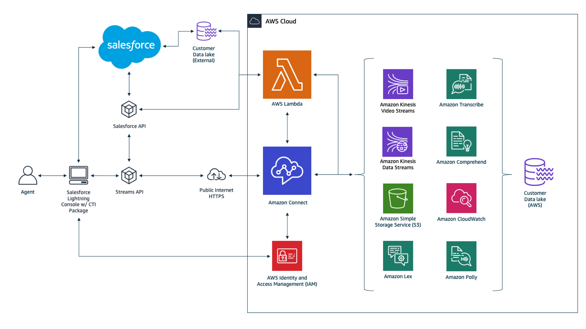

# Amazon Connect CTI Adapter v5 for Salesforce Lightning

<h3 align="center"> Setup and Installation Guide</h3>

  

<h3 align="center"> September, 2020</h3>

_© Copyright Amazon.com, Inc. or its affiliates. All Rights Reserved. SPDX-License-Identifier: CC-BY-SA-4.0_

#### Notices

This document is provided for informational purposes only. It represents
AWS's current product offerings and practices as of the date of issue of
this document, which are subject to change without notice. Customers are
responsible for making their own independent assessment of the
information in this document and any use of AWS's products or services,
each of which is provided "as is" without warranty of any kind, whether
express or implied. This document does not create any warranties,
representations, contractual commitments, conditions or assurances from
AWS, its affiliates, suppliers or licensors. The responsibilities and
liabilities of AWS to its customers are controlled by AWS agreements,
and this document is not part of, nor does it modify, any agreement
between AWS and its customers.

#### Abstract

This guide details the integration between Amazon Connect and Salesforce
Lightning. It covers the installation, configuration, and operation of
the two primary components of the integration: the Amazon Connect CTI
Adapter for Salesforce and the AWS Serverless Application Repository for
Amazon Connect Salesforce integration.

<!--
In order for the table of contents to work with the PDF generator, make sure the header of the section
the table of contents entry should link to has an id that matches the text of the link, lowercase, and
with dashes (-) in place for spaces. ex. the 'Key Benefits and Requirements' will navigate to a link
with id 'key-benefits-and-requirements'
-->

# Table of Contents

- Introduction
  - [Key Benefits and Requirements](01%20Introduction/01%20Key%20Benefits%20and%20Requirements.md#key-benefits-and-requirements)
    - [Key Benefits](01%20Introduction/01%20Key%20Benefits%20and%20Requirements.md#key-benefits)
    - [Requirements](01%20Introduction/01%20Key%20Benefits%20and%20Requirements.md#requirements)
- [Installation](02%20Installation/readme.md#installation)
  - [Installing CTI Adapter Managed Package from AppExchange](02%20Installation/01%20Installing%20CTI%20Adapter%20Managed%20Package%20from%20AppExchange.md#installing-cti-adapter-managed-package-from-appexchange)
    - [Installing the Package](02%20Installation/01%20Installing%20CTI%20Adapter%20Managed%20Package%20from%20AppExchange.md#installing-the-package)
    - [Set Access Permissions](02%20Installation/01%20Installing%20CTI%20Adapter%20Managed%20Package%20from%20AppExchange.md#set-access-permissions)
    - [Configure the Lightning Experience](02%20Installation/01%20Installing%20CTI%20Adapter%20Managed%20Package%20from%20AppExchange.md#configure-the-lightning-experience)
      - [Configure Service Console](02%20Installation/01%20Installing%20CTI%20Adapter%20Managed%20Package%20from%20AppExchange.md#configure-service-console)
      - [Whitelist Your Salesforce Org with Amazon Connect](02%20Installation/01%20Installing%20CTI%20Adapter%20Managed%20Package%20from%20AppExchange.md#whitelist-your-salesforce-org-with-amazon-connect)
      - [Modify the Call Center](02%20Installation/01%20Installing%20CTI%20Adapter%20Managed%20Package%20from%20AppExchange.md#modify-the-call-center)
      - [Configure the Toolkit settings](02%20Installation/01%20Installing%20CTI%20Adapter%20Managed%20Package%20from%20AppExchange.md#configure-the-toolkit-settings)
      - [Create the Softphone Layout](02%20Installation/01%20Installing%20CTI%20Adapter%20Managed%20Package%20from%20AppExchange.md#create-the-softphone-layout)
    - [Initial CTI Adapter Configuration](02%20Installation/01%20Installing%20CTI%20Adapter%20Managed%20Package%20from%20AppExchange.md#initial-cti-adapter-configuration)
      - [Add the CTI Adapter Console App](02%20Installation/01%20Installing%20CTI%20Adapter%20Managed%20Package%20from%20AppExchange.md#add-the-cti-adapter-console-app)
      - [Enhanced Agent Logout](02%20Installation/01%20Installing%20CTI%20Adapter%20Managed%20Package%20from%20AppExchange.md#enhanced-agent-logout)
      - [Validate Basic Screenpop](02%20Installation/01%20Installing%20CTI%20Adapter%20Managed%20Package%20from%20AppExchange.md#validate-basic-screenpop)
  - [Installing the Amazon Connect Salesforce Lambda Package](02%20Installation/02%20Installing%20the%20Amazon%20Connect%20Salesforce%20Lambda%20Package.md#installing-the-amazon-connect-salesforce-lambda-package)
    - [Prerequisite Configuration and Data Collection](02%20Installation/02%20Installing%20the%20Amazon%20Connect%20Salesforce%20Lambda%20Package.md#prerequisite-configuration-and-data-collection)
      - [Check your Salesforce API Version](02%20Installation/02%20Installing%20the%20Amazon%20Connect%20Salesforce%20Lambda%20Package.md#check-your-salesforce-api-version)
      - [Create a New Connected App](02%20Installation/02%20Installing%20the%20Amazon%20Connect%20Salesforce%20Lambda%20Package.md#create-a-new-connected-app)
      - [Create a new API user](02%20Installation/02%20Installing%20the%20Amazon%20Connect%20Salesforce%20Lambda%20Package.md#create-a-new-api-user)
      - [Gather Information from Your Amazon Connect Instance](02%20Installation/02%20Installing%20the%20Amazon%20Connect%20Salesforce%20Lambda%20Package.md#gather-information-from-your-amazon-connect-instance)
      - [Store Salesforce Credentials in AWS Secrets Manager](02%20Installation/02%20Installing%20the%20Amazon%20Connect%20Salesforce%20Lambda%20Package.md#store-salesforce-credentials-in-aws-secrets-manager)
    - [Install the Amazon Connect Salesforce Lambda package](02%20Installation/02%20Installing%20the%20Amazon%20Connect%20Salesforce%20Lambda%20Package.md#install-the-amazon-connect-salesforce-lambda-package)
    - [Test the Core Functionality](02%20Installation/02%20Installing%20the%20Amazon%20Connect%20Salesforce%20Lambda%20Package.md#test-the-core-functionality)
      - [Validate the core functionality](02%20Installation/02%20Installing%20the%20Amazon%20Connect%20Salesforce%20Lambda%20Package.md#validate-the-core-functionality)
    - [Allow Amazon Connect to Access the sfInvokeAPI Lambda Function](02%20Installation/02%20Installing%20the%20Amazon%20Connect%20Salesforce%20Lambda%20Package.md#allow-amazon-connect-to-access-the-sfinvokeapi-lambda-function)
      - [Add the Lambda function to your Amazon Connect instance](02%20Installation/02%20Installing%20the%20Amazon%20Connect%20Salesforce%20Lambda%20Package.md#add-the-lambda-function-to-your-amazon-connect-instance)
  - [Upgrading from an Earlier Version](02%20Installation/03%20Upgrading%20from%20an%20Earlier%20Version.md#upgrading-from-an-earlier-version)
  - [CTI Adapter Installation Troubleshooting and Common Issues](02%20Installation/04%20CTI%20Adapter%20Installation%20Troubleshooting.md#cti-adapter-installation-troubleshooting-and-common-issues)
- [Configuring and Using CTI Adapter Features](03%20Configuring%20and%20Using%20CTI%20Adapter%20Features/readme.md#configuring-and-using-cti-adapter-features)
  - [CTI Adapter Details](03%20Configuring%20and%20Using%20CTI%20Adapter%20Features/01%20CTI%20Adapter%20Configuration.md#cti-adapter-details)
      - [Update the CTI Adapter Details](03%20Configuring%20and%20Using%20CTI%20Adapter%20Features/01%20CTI%20Adapter%20Configuration.md#update-the-cti-adapter-details)
    - [Single Sign On Settings](03%20Configuring%20and%20Using%20CTI%20Adapter%20Features/01%20CTI%20Adapter%20Configuration.md#single-sign-on-settings)
      - [Identify the SSO URL components](03%20Configuring%20and%20Using%20CTI%20Adapter%20Features/01%20CTI%20Adapter%20Configuration.md#identify-the-sso-url-components)
      - [Configure the CTI Lightning Adapter in Salesforce](03%20Configuring%20and%20Using%20CTI%20Adapter%20Features/01%20CTI%20Adapter%20Configuration.md#configure-the-cti-lightning-adapter-in-salesforce)
  - [CTI Attributes](03%20Configuring%20and%20Using%20CTI%20Adapter%20Features/02%20CTI%20Attributes.md#cti-attributes)
    - [Attribute Properties](03%20Configuring%20and%20Using%20CTI%20Adapter%20Features/02%20CTI%20Attributes.md#attribute-properties)
    - [CTI Attributes Example Walkthrough](03%20Configuring%20and%20Using%20CTI%20Adapter%20Features/02%20CTI%20Attributes.md#cti-attributes-example-walkthrough)
      - [Adding a Text-based CTI Attribute](03%20Configuring%20and%20Using%20CTI%20Adapter%20Features/02%20CTI%20Attributes.md#adding-a-text-based-cti-attribute)
      - [Adding a Hyperlink-based CTI Attribute](03%20Configuring%20and%20Using%20CTI%20Adapter%20Features/02%20CTI%20Attributes.md#adding-a-hyperlink-based-cti-attribute)
    - [CTI Attribute Additional Features](03%20Configuring%20and%20Using%20CTI%20Adapter%20Features/02%20CTI%20Attributes.md#cti-attribute-additional-features)
      - [Enabling CTI Attribute Additional Features](03%20Configuring%20and%20Using%20CTI%20Adapter%20Features/02%20CTI%20Attributes.md#enabling-cti-attribute-additional-features)
  - [CTI Flows](03%20Configuring%20and%20Using%20CTI%20Adapter%20Features/03%20CTI%20Flows.md#cti-flows)
  - [Presence Sync Rules](03%20Configuring%20and%20Using%20CTI%20Adapter%20Features/04%20Presence%20Sync%20Rules.md#presence-sync-rules)
    - [Configuring Statuses](03%20Configuring%20and%20Using%20CTI%20Adapter%20Features/04%20Presence%20Sync%20Rules.md#configuring-statuses)
    - [Amazon Connect System Statuses](03%20Configuring%20and%20Using%20CTI%20Adapter%20Features/04%20Presence%20Sync%20Rules.md#amazon-connect-system-statuses)
    - [Create Presence Statuses in Amazon Connect](03%20Configuring%20and%20Using%20CTI%20Adapter%20Features/04%20Presence%20Sync%20Rules.md#create-presence-statuses-in-amazon-connect)
      - [Create an Amazon Connect status](03%20Configuring%20and%20Using%20CTI%20Adapter%20Features/04%20Presence%20Sync%20Rules.md#create-an-amazon-connect-status)
    - [Create Presence Statuses in Salesforce](03%20Configuring%20and%20Using%20CTI%20Adapter%20Features/04%20Presence%20Sync%20Rules.md#create-presence-statuses-in-salesforce)
      - [Create a Salesforce presence status](03%20Configuring%20and%20Using%20CTI%20Adapter%20Features/04%20Presence%20Sync%20Rules.md#create-a-salesforce-presence-status)
      - [Configure Enabled Service Presences Status Access in Salesforce](03%20Configuring%20and%20Using%20CTI%20Adapter%20Features/04%20Presence%20Sync%20Rules.md#configure-enabled-service-presences-status-access-in-salesforce)
    - [Configure Presence Sync Rules](03%20Configuring%20and%20Using%20CTI%20Adapter%20Features/04%20Presence%20Sync%20Rules.md#configure-presence-sync-rules)
      - [Create a Presence Sync Rule](03%20Configuring%20and%20Using%20CTI%20Adapter%20Features/04%20Presence%20Sync%20Rules.md#create-a-presence-sync-rule)
  - [Localization](03%20Configuring%20and%20Using%20CTI%20Adapter%20Features/05%20Localization.md#localization)
  - [Set Agent Status on Session End](03%20Configuring%20and%20Using%20CTI%20Adapter%20Features/05%20Set%20Agent%20Status%20on%20Session%20End.md#set-agent-status-on-session-end)
- [Configuring and Using AWS Serverless Application Repository for Salesforce Features](04%20Configuring%20and%20Using%20AWS%20Serverless%20Application%20Repository%20for%20Salesforce%20Features/readme.md#configuring-and-using-aws-serverless-application-repository-for-salesforce-features)
  - [Accessing the Salesforce API from Amazon Connect Contact Flows Using AWS Lambda](04%20Configuring%20and%20Using%20AWS%20Serverless%20Application%20Repository%20for%20Salesforce%20Features/01%20Accessing%20the%20Salesforce%20API%20from%20Amazon%20Connect%20Contact%20Flows%20Using%20AWS%20Lambda.md#accessing-the-salesforce-api-from-amazon-connect-contact-flows-using-aws-lambda)
    - [Salesforce Lookup](04%20Configuring%20and%20Using%20AWS%20Serverless%20Application%20Repository%20for%20Salesforce%20Features/01%20Accessing%20the%20Salesforce%20API%20from%20Amazon%20Connect%20Contact%20Flows%20Using%20AWS%20Lambda.md#salesforce-lookup)
    - [Salesforce Create](04%20Configuring%20and%20Using%20AWS%20Serverless%20Application%20Repository%20for%20Salesforce%20Features/01%20Accessing%20the%20Salesforce%20API%20from%20Amazon%20Connect%20Contact%20Flows%20Using%20AWS%20Lambda.md#salesforce-create)
    - [Salesforce Update](04%20Configuring%20and%20Using%20AWS%20Serverless%20Application%20Repository%20for%20Salesforce%20Features/01%20Accessing%20the%20Salesforce%20API%20from%20Amazon%20Connect%20Contact%20Flows%20Using%20AWS%20Lambda.md#salesforce-update)
    - [Salesforce Phone Lookup](04%20Configuring%20and%20Using%20AWS%20Serverless%20Application%20Repository%20for%20Salesforce%20Features/01%20Accessing%20the%20Salesforce%20API%20from%20Amazon%20Connect%20Contact%20Flows%20Using%20AWS%20Lambda.md#salesforce-phone-lookup)
    - [Salesforce Delete](04%20Configuring%20and%20Using%20AWS%20Serverless%20Application%20Repository%20for%20Salesforce%20Features/01%20Accessing%20the%20Salesforce%20API%20from%20Amazon%20Connect%20Contact%20Flows%20Using%20AWS%20Lambda.md#salesforce-delete)
    - [Salesforce query](04%20Configuring%20and%20Using%20AWS%20Serverless%20Application%20Repository%20for%20Salesforce%20Features/01%20Accessing%20the%20Salesforce%20API%20from%20Amazon%20Connect%20Contact%20Flows%20Using%20AWS%20Lambda.md#salesforce-query)
    - [Salesforce queryOne](04%20Configuring%20and%20Using%20AWS%20Serverless%20Application%20Repository%20for%20Salesforce%20Features/01%20Accessing%20the%20Salesforce%20API%20from%20Amazon%20Connect%20Contact%20Flows%20Using%20AWS%20Lambda.md#salesforce-queryone)
    - [Salesforce createChatterPost](04%20Configuring%20and%20Using%20AWS%20Serverless%20Application%20Repository%20for%20Salesforce%20Features/01%20Accessing%20the%20Salesforce%20API%20from%20Amazon%20Connect%20Contact%20Flows%20Using%20AWS%20Lambda.md#salesforce-createchatterpost)
    - [Salesforce createChatterComment](04%20Configuring%20and%20Using%20AWS%20Serverless%20Application%20Repository%20for%20Salesforce%20Features/01%20Accessing%20the%20Salesforce%20API%20from%20Amazon%20Connect%20Contact%20Flows%20Using%20AWS%20Lambda.md#salesforce-createchattercomment)
  - [Amazon Connect Historical Metrics in Salesforce](04%20Configuring%20and%20Using%20AWS%20Serverless%20Application%20Repository%20for%20Salesforce%20Features/02%20Amazon%20Connect%20Historical%20Metrics%20in%20Salesforce.md#amazon-connect-historical-metrics-in-salesforce)
    - [Configuring the AWS Services](04%20Configuring%20and%20Using%20AWS%20Serverless%20Application%20Repository%20for%20Salesforce%20Features/02%20Amazon%20Connect%20Historical%20Metrics%20in%20Salesforce.md#configuring-the-aws-services)
      - [Configuring the Historical Reports in Amazon Connect](04%20Configuring%20and%20Using%20AWS%20Serverless%20Application%20Repository%20for%20Salesforce%20Features/02%20Amazon%20Connect%20Historical%20Metrics%20in%20Salesforce.md#configuring-the-historical-reports-in-amazon-connect)
      - [Creating the AWS Lambda Trigger for the Queue Data](04%20Configuring%20and%20Using%20AWS%20Serverless%20Application%20Repository%20for%20Salesforce%20Features/02%20Amazon%20Connect%20Historical%20Metrics%20in%20Salesforce.md#creating-the-aws-lambda-trigger-for-the-queue-data)
      - [Creating the AWS Lambda Trigger for the Agent Data](04%20Configuring%20and%20Using%20AWS%20Serverless%20Application%20Repository%20for%20Salesforce%20Features/02%20Amazon%20Connect%20Historical%20Metrics%20in%20Salesforce.md#creating-the-aws-lambda-trigger-for-the-agent-data)
    - [Verifying the Data Import in Salesforce](04%20Configuring%20and%20Using%20AWS%20Serverless%20Application%20Repository%20for%20Salesforce%20Features/02%20Amazon%20Connect%20Historical%20Metrics%20in%20Salesforce.md#verifying-the-data-import-in-salesforce)
      - [Viewing Amazon Connect Reports in Salesforce](04%20Configuring%20and%20Using%20AWS%20Serverless%20Application%20Repository%20for%20Salesforce%20Features/02%20Amazon%20Connect%20Historical%20Metrics%20in%20Salesforce.md#viewing-amazon-connect-reports-in-salesforce)
  - [Amazon Connect Real-Time Metrics in Salesforce](04%20Configuring%20and%20Using%20AWS%20Serverless%20Application%20Repository%20for%20Salesforce%20Features/03%20Amazon%20Connect%20Real-Time%20Metrics%20in%20Salesforce.md#amazon-connect-real-time-metrics-in-salesforce)
    - [Deployment and Configuration](04%20Configuring%20and%20Using%20AWS%20Serverless%20Application%20Repository%20for%20Salesforce%20Features/03%20Amazon%20Connect%20Real-Time%20Metrics%20in%20Salesforce.md#deployment-and-configuration)
      - [Adding Real-Time Reports to the Service Console](04%20Configuring%20and%20Using%20AWS%20Serverless%20Application%20Repository%20for%20Salesforce%20Features/03%20Amazon%20Connect%20Real-Time%20Metrics%20in%20Salesforce.md#adding-real-time-reports-to-the-service-console)
  - [Contact Channel Analytics](04%20Configuring%20and%20Using%20AWS%20Serverless%20Application%20Repository%20for%20Salesforce%20Features/04%20Contact%20Channel%20Analytics.md#contact-channel-analytics)
    - [Prerequisite Setup](04%20Configuring%20and%20Using%20AWS%20Serverless%20Application%20Repository%20for%20Salesforce%20Features/04%20Contact%20Channel%20Analytics.md#prerequisite-setup)
    - [Call Recording Import](04%20Configuring%20and%20Using%20AWS%20Serverless%20Application%20Repository%20for%20Salesforce%20Features/04%20Contact%20Channel%20Analytics.md#call-recording-import)
      - [Enabling call recording import](04%20Configuring%20and%20Using%20AWS%20Serverless%20Application%20Repository%20for%20Salesforce%20Features/04%20Contact%20Channel%20Analytics.md#enabling-call-recording-import)
      - [Adding Contact Channel Analytics to the Service Console](04%20Configuring%20and%20Using%20AWS%20Serverless%20Application%20Repository%20for%20Salesforce%20Features/04%20Contact%20Channel%20Analytics.md#adding-contact-channel-analytics-to-the-service-console)
    - [Recording Transcripts](04%20Configuring%20and%20Using%20AWS%20Serverless%20Application%20Repository%20for%20Salesforce%20Features/04%20Contact%20Channel%20Analytics.md#recording-transcripts)
      - [Enabling recording transcription](04%20Configuring%20and%20Using%20AWS%20Serverless%20Application%20Repository%20for%20Salesforce%20Features/04%20Contact%20Channel%20Analytics.md#enabling-recording-transcription)
      - [Accessing transcriptions](04%20Configuring%20and%20Using%20AWS%20Serverless%20Application%20Repository%20for%20Salesforce%20Features/04%20Contact%20Channel%20Analytics.md#accessing-transcriptions)
    - [AI Driven Contact Analysis](04%20Configuring%20and%20Using%20AWS%20Serverless%20Application%20Repository%20for%20Salesforce%20Features/04%20Contact%20Channel%20Analytics.md#ai-driven-contact-analysis)
      - [Enabling AI Driven Contact Analysis](04%20Configuring%20and%20Using%20AWS%20Serverless%20Application%20Repository%20for%20Salesforce%20Features/04%20Contact%20Channel%20Analytics.md#enabling-ai-driven-contact-analysis)
      - [Accessing the AI Driven Contact Analysis](04%20Configuring%20and%20Using%20AWS%20Serverless%20Application%20Repository%20for%20Salesforce%20Features/04%20Contact%20Channel%20Analytics.md#accessing-the-ai-driven-contact-analysis)
  - [Contact Trace Record Import](04%20Configuring%20and%20Using%20AWS%20Serverless%20Application%20Repository%20for%20Salesforce%20Features/05%20Contact%20Trace%20Record%20Import.md#contact-trace-record-import)
    - [Contact Trace Record Import](04%20Configuring%20and%20Using%20AWS%20Serverless%20Application%20Repository%20for%20Salesforce%20Features/05%20Contact%20Trace%20Record%20Import.md#contact-trace-record-import)
      - [Enabling Contact Trace Record Import](04%20Configuring%20and%20Using%20AWS%20Serverless%20Application%20Repository%20for%20Salesforce%20Features/05%20Contact%20Trace%20Record%20Import.md#enabling-contact-trace-record-import)
      - [Adding Contact Trace Records to the Service Console](04%20Configuring%20and%20Using%20AWS%20Serverless%20Application%20Repository%20for%20Salesforce%20Features/05%20Contact%20Trace%20Record%20Import.md#adding-contact-trace-records-to-the-service-console)
    - [Display Additional Contact Trace Record Data](04%20Configuring%20and%20Using%20AWS%20Serverless%20Application%20Repository%20for%20Salesforce%20Features/05%20Contact%20Trace%20Record%20Import.md#display-additional-contact-trace-record-data)
      - [Customizing the AC Contact Trace Record Layout](04%20Configuring%20and%20Using%20AWS%20Serverless%20Application%20Repository%20for%20Salesforce%20Features/05%20Contact%20Trace%20Record%20Import.md#customizing-the-ac-contact-trace-record-layout)
- [Appendix A - Required Salesforce Configurations](05%20Appendix%20A%20-%20Required%20Salesforce%20Configurations/readme.md#appendix-a---required-salesforce-configurations)
  - [Configuring My Domain in Salesforce](05%20Appendix%20A%20-%20Required%20Salesforce%20Configurations/01%20Configuring%20My%20Domain%20in%20Salesforce.md#configuring-my-domain-in-salesforce)
    - [Register Your Domain](05%20Appendix%20A%20-%20Required%20Salesforce%20Configurations/01%20Configuring%20My%20Domain%20in%20Salesforce.md#register-your-domain)
    - [Deploy the Domain to Your Users](05%20Appendix%20A%20-%20Required%20Salesforce%20Configurations/01%20Configuring%20My%20Domain%20in%20Salesforce.md#deploy-the-domain-to-your-users)
  - [Configure Salesforce Omnichannel for Testing](05%20Appendix%20A%20-%20Required%20Salesforce%20Configurations/02%20Configure%20Salesforce%20Omnichannel%20for%20Testing.md#configure-salesforce-omnichannel-for-testing)
    - [Enable Omnichannel](05%20Appendix%20A%20-%20Required%20Salesforce%20Configurations/02%20Configure%20Salesforce%20Omnichannel%20for%20Testing.md#enable-omnichannel)
      - [Enable Omnichannel in Your Salesforce Org](05%20Appendix%20A%20-%20Required%20Salesforce%20Configurations/02%20Configure%20Salesforce%20Omnichannel%20for%20Testing.md#enable-omnichannel-in-your-salesforce-org)
    - [Configure Presence Statuses](05%20Appendix%20A%20-%20Required%20Salesforce%20Configurations/02%20Configure%20Salesforce%20Omnichannel%20for%20Testing.md#configure-presence-statuses)
      - [Add a Presence Status](05%20Appendix%20A%20-%20Required%20Salesforce%20Configurations/02%20Configure%20Salesforce%20Omnichannel%20for%20Testing.md#add-a-presence-status)
    - [Configure Profiles to Use the New Statuses](05%20Appendix%20A%20-%20Required%20Salesforce%20Configurations/02%20Configure%20Salesforce%20Omnichannel%20for%20Testing.md#configure-profiles-to-use-the-new-statuses)
      - [Modify Profiles to Use New Statuses](05%20Appendix%20A%20-%20Required%20Salesforce%20Configurations/02%20Configure%20Salesforce%20Omnichannel%20for%20Testing.md#modify-profiles-to-use-new-statuses)
    - [Add Omni-Channel to the Utility Bar](05%20Appendix%20A%20-%20Required%20Salesforce%20Configurations/02%20Configure%20Salesforce%20Omnichannel%20for%20Testing.md#add-omni-channel-to-the-utility-bar)
      - [Add the Omni-Channel Utility Item](05%20Appendix%20A%20-%20Required%20Salesforce%20Configurations/02%20Configure%20Salesforce%20Omnichannel%20for%20Testing.md#add-the-omni-channel-utility-item)
- [Appendix B - Configuring Salesforce as Your Identity Provider](06%20Appendix%20B%20-%20Configuring%20Salesforce%20as%20Your%20Identity%20Provider/readme.md#appendix-b---configuring-salesforce-as-your-identity-provider)
  - [Configuration](06%20Appendix%20B%20-%20Configuring%20Salesforce%20as%20Your%20Identity%20Provider/01%20Configuration.md#configuration)
    - [Prerequisites](06%20Appendix%20B%20-%20Configuring%20Salesforce%20as%20Your%20Identity%20Provider/01%20Configuration.md#prerequisites)
    - [Configuring Salesforce as an Identity Provider](06%20Appendix%20B%20-%20Configuring%20Salesforce%20as%20Your%20Identity%20Provider/01%20Configuration.md#configuring-salesforce-as-an-identity-provider)
      - [Setup Identity Provider & Download Metadata](06%20Appendix%20B%20-%20Configuring%20Salesforce%20as%20Your%20Identity%20Provider/01%20Configuration.md#setup-identity-provider--download-metadata)
    - [Configure the Identity Provider, Policy, and Role in the AWS Console](06%20Appendix%20B%20-%20Configuring%20Salesforce%20as%20Your%20Identity%20Provider/01%20Configuration.md#configure-the-identity-provider-policy-and-role-in-the-aws-console)
      - [Configure the Identity Provider](06%20Appendix%20B%20-%20Configuring%20Salesforce%20as%20Your%20Identity%20Provider/01%20Configuration.md#configure-the-identity-provider)
      - [Create the IAM Role and Policy](06%20Appendix%20B%20-%20Configuring%20Salesforce%20as%20Your%20Identity%20Provider/01%20Configuration.md#create-the-iam-role-and-policy)
    - [Complete the Base Salesforce Configuration](06%20Appendix%20B%20-%20Configuring%20Salesforce%20as%20Your%20Identity%20Provider/01%20Configuration.md#complete-the-base-salesforce-configuration)
      - [Create the Connected App in Salesforce](06%20Appendix%20B%20-%20Configuring%20Salesforce%20as%20Your%20Identity%20Provider/01%20Configuration.md#create-the-connected-app-in-salesforce)
    - [Complete the Amazon Connect Configuration](06%20Appendix%20B%20-%20Configuring%20Salesforce%20as%20Your%20Identity%20Provider/01%20Configuration.md#complete-the-amazon-connect-configuration)
      - [Add Users to Amazon Connect](06%20Appendix%20B%20-%20Configuring%20Salesforce%20as%20Your%20Identity%20Provider/01%20Configuration.md#add-users-to-amazon-connect)
    - [Final Configuration for the Lightning Experience](06%20Appendix%20B%20-%20Configuring%20Salesforce%20as%20Your%20Identity%20Provider/01%20Configuration.md#final-configuration-for-the-lightning-experience)
      - [Create the Amazon Connect SSO URL](06%20Appendix%20B%20-%20Configuring%20Salesforce%20as%20Your%20Identity%20Provider/01%20Configuration.md#create-the-amazon-connect-sso-url)
      - [Configure the CTI Lightning Adapter in Salesforce For SSO](06%20Appendix%20B%20-%20Configuring%20Salesforce%20as%20Your%20Identity%20Provider/01%20Configuration.md#configure-the-cti-lightning-adapter-in-salesforce-for-sso)
- [Appendix C - CTI Flow Sources and Events](07%20Appendix%20C%20-%20CTI%20Flow%20Sources%20and%20Events/01%20CTI%20Flow%20Sources%20and%20Events.md#appendix-c---cti-flow-sources-and-events)
- [Appendix D - CTI Flow Examples](08%20Appendix%20D%20-%20CTI%20Flow%20Examples/readme.md#appendix-d---cti-flow-examples)
  - [CTI Flow Examples](08%20Appendix%20D%20-%20CTI%20Flow%20Examples/01%20CTI%20Flow%20Examples.md#cti-flow-examples)
- [Appendix E - Integration with Salesforce High Velocity Sales](09%20Appendix%20E%20-%20Integration%20with%20Salesforce%20High%20Velocity%20Sales/readme.md#appendix-e---integration-with-salesforce-high-velocity-sales)
  - [High Velocity Sales](09%20Appendix%20E%20-%20Integration%20with%20Salesforce%20High%20Velocity%20Sales/01%20High%20Velocity%20Sales.md#high-velocity-sales)
    - [What is High Velocity Sales?](09%20Appendix%20E%20-%20Integration%20with%20Salesforce%20High%20Velocity%20Sales/01%20High%20Velocity%20Sales.md#what-is-high-velocity-sales)
    - [Enabling the Integration with High Velocity Sales](09%20Appendix%20E%20-%20Integration%20with%20Salesforce%20High%20Velocity%20Sales/01%20High%20Velocity%20Sales.md#enabling-the-integration-with-high-velocity-sales)
      - [Enable High Velocity Sales](09%20Appendix%20E%20-%20Integration%20with%20Salesforce%20High%20Velocity%20Sales/01%20High%20Velocity%20Sales.md#enable-high-velocity-sales)
    - [Call Outcomes for Branching](09%20Appendix%20E%20-%20Integration%20with%20Salesforce%20High%20Velocity%20Sales/01%20High%20Velocity%20Sales.md#call-outcomes-for-branching)
      - [Define Call Outcomes for Branching](09%20Appendix%20E%20-%20Integration%20with%20Salesforce%20High%20Velocity%20Sales/01%20High%20Velocity%20Sales.md#define-call-outcomes-for-branching)
    - [Assign HVS permission sets to Connect Users](09%20Appendix%20E%20-%20Integration%20with%20Salesforce%20High%20Velocity%20Sales/01%20High%20Velocity%20Sales.md#assign-hvs-permission-sets-to-connect-users)
      - [Assign the permission set](09%20Appendix%20E%20-%20Integration%20with%20Salesforce%20High%20Velocity%20Sales/01%20High%20Velocity%20Sales.md#assign-the-permission-set)
    - [Assigning Prospects](09%20Appendix%20E%20-%20Integration%20with%20Salesforce%20High%20Velocity%20Sales/01%20High%20Velocity%20Sales.md#assigning-prospects)
    - [Create and Map Dispositions](09%20Appendix%20E%20-%20Integration%20with%20Salesforce%20High%20Velocity%20Sales/01%20High%20Velocity%20Sales.md#create-and-map-dispositions)
      - [Create and map disposition fields](09%20Appendix%20E%20-%20Integration%20with%20Salesforce%20High%20Velocity%20Sales/01%20High%20Velocity%20Sales.md#create-and-map-disposition-fields)
    - [Setup CTI Flows for High Volume Sales](09%20Appendix%20E%20-%20Integration%20with%20Salesforce%20High%20Velocity%20Sales/01%20High%20Velocity%20Sales.md#setup-cti-flows-for-high-volume-sales)
      - [Configuring the CTI Flow](09%20Appendix%20E%20-%20Integration%20with%20Salesforce%20High%20Velocity%20Sales/01%20High%20Velocity%20Sales.md#configuring-the-cti-flow)
- [Appendix F - CTI Flow Blocks](10%20Appendix%20F%20-%20CTI%20Flow%20Blocks/01%20CTI%20Flow%20Blocks.md#appendix-f---cti-flow-blocks)

# Introduction

The Amazon Connect CTI integration consists of two components, a
[managed Salesforce package](https://appexchange.salesforce.com/listingDetail?listingId=a0N3A00000EJH4yUAH)
and an [AWS Serverless application](https://aws.amazon.com/serverless/serverlessrepo/)
deployed to your AWS environment. The managed package provides the core CTI
integration between Amazon Connect and Salesforce. The Serverless
repository adds to the core CTI integration by providing additional
tools that provide access and analysis of data from both platforms. With
these components, customers can build a deep integration between Amazon
Connect and Salesforce.

# Release Notes

Important: when upgrading the CTI Adapter, please make sure that the Salesforce Lambdas are also updated to the newest version.

## 5.7 November 2020

- **Feature**: Change audio recording feature in the Contact Channel Analytics page to use an audio streaming approach. Please review [Contact Channel Analytics](04%20Configuring%20and%20Using%20AWS%20Serverless%20Application%20Repository%20for%20Salesforce%20Features/04%20Contact%20Channel%20Analytics.md#contact-channel-analytics) in order to set the feature up.
- **Feature**: Add permission set specifically for the audio recording feature
- **Feature**: Localization into 9 languages.
- **Feature**: Add callType to return fields of "Get Contact Properties" block
- **Feature**: Add formatted phone number to return fields of "Get Contact Properties" block
- **Feature**: Add script name to CTI flow definition file.
- **Feature**: Remove context from log outputs
- **Bugfix**: Return field of “Open Primary Tab” was value, not id, as specified. We now provide it in both `value` and `id` fields for backward compatibility.
- **Feature**: Make the error message shown when the execution runs too long more informative.
- **Feature**: Make sure the attributes overlay doesn't open automatically when CCP is opened.
  Documentation: "Create and pop that task" default flow is fixed.
- **Bugfix**: update return value of "Get Agent Configuration" block to match the documentation.
- **Feature**: Increase CTI Flow timeout to 10 seconds.
- **Bugfix**: remove the leading wildcard matcher in "Get Salesforce Contact Id" block query. The wildcard matcher caused performance issues with the query. Going forward make sure the phone number is an exact match to the one in file.
- **Bugfix**: Ensure “Join Strings” block does not ignore boolean false values.
- **Bugfix**: Ensure “Log to Console” block does not ignore boolean false values.
- **Feature**: Add uid field on top of the block on the canvas.
- **Bugfix**: Remove the loginWindow object from log output because it errors with "Cannot convert object to primitive value."
- **Bugfix**: ContactChannel object updates to new agent if previous agent rejected or missed a contact
- **Bugfix**: Changing status to logout now correctly logs agent out
- **Feature**: Rename "Enable Click to Dial?" to "Can Make Outbound Calls?".
- **Feature**: CTI Flow Block - math function - “Multiply”
- **Feature**: CTI Flow Block - math function - “Divide“
- **Feature**: CTI Flow Block - “Get Tab Object Map”
- **Feature**: CTI Flow Block - “Close Salesforce Tab”
- **Feature**: CTI Flow Block - “Delay”
- **Feature**: CTI Flow Block - “Get Primary Tab Ids”
- **Feature**: Improve browser log formatting.
- **Feature**: CTI Flow Block - “Get Tabs With Matching Url”
- **Feature**: _Update Connect agent status when all Salesforce tabs are closed_: You can set the agent status to a specific state if the SetAgentStatusOnSessionEnd feature is turned on and the agent’s routing profile name includes the value of IfProfileNameIncludes setting, such as “On-Call.” By default, the agent status is set to “Offline” if the feature is enabled and nothing is specified for IfProfileNameIncludes. If this feature is enabled, the agent will be automatically shown as available when they login to Salesforce and the CCP.
- **Feature**: CTI Flow Block - Length”
- **Feature**: CTI Flow Block - "Slice"
- **Feature**: CTI Flow Block - “Cast a Value to a Type”
- **Bugfix**: Agent is able to accept calls when Medialess is turned on.
- **Feature**: CTI Flow Block - “Get CCP Logs”
  Remove "Initialization" and "Browser" sources
- **Feature**: Allow users to specify Amazon Connect Instance url in CTI Adapter details in addition to Amazon Connect Instance Alias

## 5.5 October 2020

- **Feature**: CTI Flow Block - "Clear All Properties"
- **Feature**: CTI Flow Block - "Unset Property"
- **Feature**: CTI Flow Block - "Show All Attributes"
- **Bugfix**: Attributes panel can now display attributes of transferred contacts.

## 5.4 Late September 2020

- **Feature**: You can now provide additional ad-hoc fields to "Create a Task" block. (Note: the values of these fields don't have a lookup dropdown yet.)
- **Feature**: New CTI Block! - You can now create "counters" with the "Update Counter" and read the value of your counters using "Get Counter" block.
- **Feature**: You can now get the number of open tabs from `openAgentTabs` counter.
- **Feature**: You can now compare multiple things using "Is One Of?" block in CTI Flows.
- **Feature**: New CTI Block! - You can now extract a value from a complex value, such as an array or an object, using the "Extract Value" block. (This comes handy when you retrieve a Salesforce object.)
- **Feature**: New CTI Block! - You can use the Salesforce retrieve API to fetch a record from the server by id using "Retrieve Salesforce Record" block.
- **Feature**: New CTI Block! - You can use the "Get Salesforce Contact Id" to fetch the id of a Salesforce contact by its phone number.
- **Feature**: New CTI Block! - You can now show a window alert using "Alert" block.
- **Feature**: New CTI Block! - You can now use create a complex string using string templates and multiple variables with the help of "String Template" block.
- **Bugfix**: When a screenpop is "deferred," the CTI Block used to return an inexact match and the Id field in the return value of the block would be blank. This issue has been fixed in this release.
- **Bugfix**: Presence sync is working again. The current release also reduces the wait threshold between each presence sync update from 1 second to 100ms, i.e. co-occurring events won't get lost anymore (as much).
- **Bugfix**: The encoding issue affecting "SOQL Block" has been fixed. The single quotes in the SOQL query are no longer encoded as HTML entities.
- **Bugfix**: To access the return value of another block, power users use "magic strings," e.g. \$.actions.<blockId>.results.<fieldName>, but these strings used to be cleared in the UI when the block is selected on the canvas. This issue is now fixed.
- **Bugfix**: The spelling of `TaskSubtype` field in "Create a Task" block has been fixed. Your TaskSubtype won't get lost anymore.
- **Bugfix**: Call recording view for a Case has been fixed.
- **Bugfix**: "Is Contact Inbound?" block is working again.
- **Bugfix**: "Is Truthy?" block now works with boolean input values.
- **Bugfix**: Salesforce UI onNavigationChange event listener is working again.
- **Bugfix**: We now alert you to change your instance alias if you try to sign in with instance alias set to "default."

### 5.3 September 2020

- **Bugfix**: Fix the issue that caused ACSFCCP_CallRecordingTask component to not work.

### 5.1 Late August 2020

- **Bugfix**: Ensure "Get App View" CTI Flow block doesn\'t break the sidebar
- **Enhancement**: Add "queueARN" field to "Dial Number\" CTI Flow block
- **Bugfix**: Ensure some required CTI Flow block fields are not shown as "optional"
- **Bugfix**: Ensure \"Save (or Create) a Record\" block works as expected
- **Bugfix**: Fix the validation error on "CallDurationInSeconds" field in "Create a Task\" block
- **Bugfix**: Fix phantom scrollbar on Windows machines
- **Bugfix**: Fix issue where copying contact attributes to clipboard doesn't work
- **Bugfix**: Fix issue where "saveLog" CTI Flow block throws an error
- **Bugfix**: Fix issue with onOffline Flow event not firing
- **Bugfix**: Fix various omnichannel presence sync bugs
- **Bugfix**: Ensure the CCP default dimensions are adjusted to CCPv2 defaults
- **Feature:** Add block \"Set Agent Status By Name on Connect.\"

### 5.0 August 2020

- **This release has new features and updates:** Please test and validate version 5.0 in your Salesforce sandbox before upgrading this in production.
- **CTI Flows:** CTI Flows replace Lightning CTI Extensions in allowing customers to build their agent for Lightning and Classic via a drag drop UI. Many of the CTI blocks are similar to the Lightning CTI Extension script API calls and can be mapped similarly. Lightning CTI Extension scripts are NOT automatically migrated to CTI Flows. When upgrading the with existing scripts, it will give you the option to download the existing script for reference before building your CTI Flows. We strongly recommend you validate this install/upgrade in a test environment and fully test the CTI Flows against your previous scripts functionality. Please open a support ticket if there is additional functionality you require from your current scripting implementation.
- **Security Profile improvements:** AC Administrator, AC Agent, and AC Manager permission sets to enforces objects access and fields level (FLS) as per Salesforce security guideline for managed package. To Amazon Connect Objects and fields, user should either one of Amazon Connect permission sets AC Administrator, AC Agent, and AC Manager.
- **Attributes:** Amazon Connect CCP (Contact Control Panel) in Lightning Classic now display an overlay for showing attributes consistently.
- **AWS Secrets Manager** support for storing Salesforce credentials.
- **VPC Support**: ability to place Lambdas in VPC
- **New Salesforce API integration:** Exposed new operations in sfinvokeapi read or create Salesforce records(query queryOne, createChatterPost, createChatterComment, lookup_all, delete)
- **Upgrade:** Amazon Connect Streams API bumped up to version 1.5.
- **Bugfix:** Task creation issue for non connect users - Fixed task trigger apex code, added a validation before security access check for Amazon managed package objects
- **Bugfix:** Contact interaction fixed.
- **Other minor bugfixes and improvements**

### 4.5 April 2020

- **This release has new features and updates:** Please test and validate version 4.5 in your Salesforce sandbox before upgrading this in production.
- **Installation / Configuration:** AC_Administrator permission set has been added to manage CTI Configuration in addition to AC_Manager and AC_Agent. See documentation for further information.
- **API:** Updated support for CCPv2 in Classic/Console. See documentation for Call Center settings.
- **Bugfix:** Updated attribute display to resolve duplicated attributes.
- **Security:** Improved control access at the object-level, the record-level, and at the field level.

### 4.4 March 2020

- **This release has significant new features and updates:** Please test and validate version 4.4 in your Salesforce sandbox before upgrading this in production.
- **Documentation:** Guide has been rewritten and restructured based on feedback.
- **Installation / Configuration:** Improved installation and configuration guide
- **Installation / Configuration:** Added Enhanced Agent Logout functionality to Lightning.
- **API:** Updated to the latest Amazon Connect Streams and Chat libraries
- **API:** Additional extensibility methods provided
- **Setup:** Improved Presence Sync Rule editor
- **Setup:** CTI Adapter validation is performed upon initialization and will inform the user of common misconfigurations.
- **Setup:** Additional CTI Script examples are provided.
- **Setup:** The ability to place the lightning transcript view on Task, Contact Channel, and Contact Channel Analytics object has been added.
- **Bugfix:** Updated whitelisting steps to address login popup issue.
- **Bugfix:** OmniChannel workload data not being usable has been resolved
- **Bugfix:** CTI Attribute issue when processing multiple pieces of contact attribute data has been resolved.
- **Bugfix:** The call transcript now scrolls within a fixed region rather than consuming vertical space.
- **Bugfix:** Finding Task Record in Classic/Console fixed.
- **Security:** The ability to create, update, and delete AC_CtiAdapter, AC_CtiScript, AC_CtiAttribute and AC_PresenceSyncRule records has been removed from the AC_Agent permission set.

### 4.2 December 2019

- **This release has significant new features and updates:** Please test and validate version 4.2 in your Salesforce sandbox before upgrading this in production.
- **Installation / Configuration**: Improved installation and configuration guide
- **API**: Lightning CCP Extension scripts and reference guide
- **Setup**: A default CTI adapter and scripts for click-to-dial, voice contact pop, and chat contact pop are not included in the base installation.
- **Editor**: A more robust script editor is included for use in CTI adapter / script configuration.
- **Bugfix**: SSO issue has been resolved

### 4.1 November 2019

- **This release has significant new features and updates:** Please test and validate version 4.1 in your Salesforce sandbox before upgrading this in production. As we look to simplify documentation, this release introduces a new [**Amazon Connect CTI Adapter v4 for Salesforce Lightning**](https://connect-blogs.s3.amazonaws.com/Amazon+Connect+Salesforce+CTI+Adapter/Amazon+Connect+CTI+Adapter+for+Salesforce+Lightning+-+Setup+and+Installation+Guide.pdf) setup and installation guide. Please review this setup guide in detail to see all the latest changes for Lightning CTI Adapter installations.
- **Classic and Console CTI setup guide:** Please use the [**Amazon Connect CTI Adapter v4 for Salesforce Classic**](https://connect-blogs.s3.amazonaws.com/Amazon+Connect+Salesforce+CTI+Adapter/Amazon+Connect+CTI+Adapter+for+Salesforce+Classic+-+Setup+and+Installation+Guide.pdf) setup and installation guide for Classic and Console CTI Adapter installations.
- **Amazon Connect Chat and Contact Control Panel (CCP) v2:** support for Amazon Connect chat and integration of CCP v2. CCP v2 is required for Lightning CTI Adapter installations. CCP v1 is still supported for Classic / Console CTI Adapter installations.
- **Historical and Real-Time Reporting:** updated historical metric functionality with additional metrics and dashboards. Added real-time metrics and dashboards. This functionality requires an update of AWS Serverless Lambda functions for Salesforce.
- **Lightning CCP Extensions and configuration:** We have revamped the approach for the Call Center config and have added a new AC CTI Adapters Lighting config page.
- **High Velocity Sales:** CTI Adapter integration supported for Salesforce High Velocity Sales product.
